<div align="center">

<svg width="760" height="150" viewBox="0 0 760 150" xmlns="http://www.w3.org/2000/svg" role="img" aria-label="DevSecOps Day 1 banner">
  <defs>
    <linearGradient id="g1" x1="0" y1="0" x2="1" y2="1">
      <stop offset="0%" stop-color="#0b3d91"/>
      <stop offset="100%" stop-color="#1f8fff"/>
    </linearGradient>
  </defs>
  <rect x="0" y="0" width="760" height="150" rx="16" fill="url(#g1)"/>
  <circle cx="92" cy="75" r="42" fill="none" stroke="#ffffff" stroke-width="4" opacity="0.95"/>
  <path d="M92 40 l28 12 v22 c0 22 -16 34 -28 41 c-12 -7 -28 -19 -28 -41 v-22 z" fill="#ffffff" opacity="0.18"/>
  <path d="M80 76 l8 8 l18 -20" fill="none" stroke="#ffffff" stroke-width="5" stroke-linecap="round" stroke-linejoin="round"/>
  <text x="160" y="62" font-family="Segoe UI, Arial, sans-serif" font-size="34" font-weight="700" fill="#ffffff">DevSecOps Intensive</text>
  <text x="160" y="96" font-family="Segoe UI, Arial, sans-serif" font-size="20" fill="#dbeafe">Day 1 — Foundations, Secure Coding, SAST &amp; DAST</text>
  <text x="160" y="124" font-family="Segoe UI, Arial, sans-serif" font-size="14" fill="#bfdbfe">Hands-on study material</text>
</svg>

</div>

# 📘 Day 1 — DevSecOps Foundations + Secure Coding + SAST & DAST

> **Program:** 4-Day DevSecOps Hands-on Training
> **Mode:** Fully practical, lab-driven
> **Scope of Day 1:** Introduction to DevSecOps · Secure Coding Practices · OWASP Top 10 · Input validation, secure authentication & encryption basics · Static Analysis (SAST) · Dynamic Analysis (DAST)

---

## 🎯 Day 1 Learning Outcomes

After completing Day 1 you will be able to:

1. Explain **what DevSecOps is** and why "shift-left security" matters.
2. Recognise the **OWASP Top 10** vulnerability classes and spot them in real code.
3. Apply core **secure coding practices**: input validation, secure authentication, and encryption basics.
4. Run a **SAST** scan (SonarQube) on source code, read the findings, and fix them.
5. Run a **DAST** scan (OWASP ZAP) against a running application and interpret the alerts.
6. Take a vulnerable application, **find → fix → re-scan**, and prove the vulnerability is gone.

---

## 🗺 Day 1 Roadmap

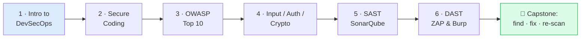

---

# 🔧 Prerequisites & Lab Setup

Complete this section before starting Module 1. Everything we use runs on Docker so that every machine behaves identically.

### What we install and why

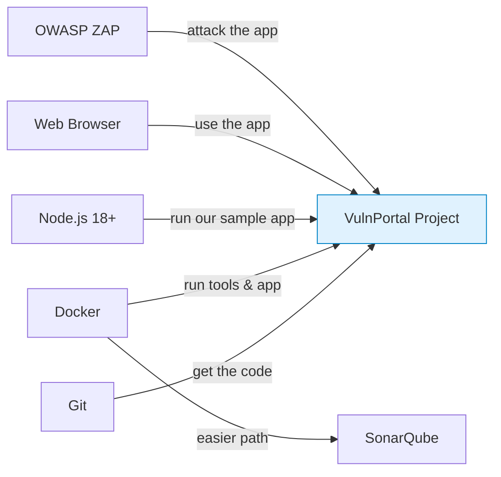

### ✅ Required software

| Tool | Version | Purpose | Source |
|---|---|---|---|
| **Git** | any recent | Download the sample project | git-scm.com |
| **Docker Desktop** | latest | Run SonarQube, the app, scanners, containers | docker.com |
| **Node.js** | 18 LTS or 20 LTS | Run the vulnerable sample app | nodejs.org |
| **VS Code** | latest | Edit code & review findings | code.visualstudio.com |
| **OWASP ZAP** | 2.15+ | Dynamic scanning (DAST) | zaproxy.org |
| **Modern browser** | Chrome / Firefox | Use the app + Burp proxy | — |

### 🧪 Lab 0 — Verify the environment

Run each command; none should error:

```bash
git --version          # e.g. git version 2.43.0
docker --version       # e.g. Docker version 26.x
docker run hello-world # must print "Hello from Docker!"
node --version         # v18.x or v20.x
npm --version          # 9.x or 10.x
```

> 🧯 **If `docker run hello-world` fails:** Docker Desktop isn't started, virtualization is off in BIOS, or (on Windows) WSL2 isn't enabled. This must be fixed first — Docker is the backbone of all four days.

### 📦 The sample application — "VulnPortal"

A single, deliberately-vulnerable Node.js application is used throughout the entire program. On Day 1 we scan and fix it; over the following days it is containerized, dependency-scanned, secret-managed, and hardened until it becomes the **Secure Student Portal** capstone.

> 💡 **Why a "vulnerable on purpose" app?** This is the standard approach in security training (as with OWASP *Juice Shop* or *DVWA*). Defence is learned by safely studying real weaknesses in a sandbox — these patterns must **never** be used in production.

**🧪 Lab 0.1 — Create and run VulnPortal**

```bash
mkdir vulnportal && cd vulnportal
npm init -y
npm install express sqlite3 body-parser
```

Create `app.js` with the following **intentionally insecure** code (it is fixed later today):

```javascript
// app.js — VulnPortal (INTENTIONALLY VULNERABLE - training only)
const express = require('express');
const bodyParser = require('body-parser');
const sqlite3 = require('sqlite3').verbose();
const crypto = require('crypto');

const app = express();
app.use(bodyParser.urlencoded({ extended: true }));

// ❌ VULN 1: hardcoded secret in source code
const API_SECRET = "S3cr3t-Pa55w0rd-DoNotCommit";

const db = new sqlite3.Database(':memory:');
db.serialize(() => {
  db.run("CREATE TABLE users (id INT, name TEXT, pass TEXT)");
  // ❌ VULN 2: passwords hashed with weak MD5
  const md5 = (s) => crypto.createHash('md5').update(s).digest('hex');
  db.run("INSERT INTO users VALUES (1,'admin', ?)", md5('admin123'));
});

app.get('/', (req, res) => {
  res.send('<h1>VulnPortal</h1><a href="/search?q=test">Search</a>');
});

// ❌ VULN 3: SQL Injection (string concatenation)
// ❌ VULN 4: Reflected XSS (raw echo of user input)
app.get('/search', (req, res) => {
  const q = req.query.q;
  const sql = "SELECT name FROM users WHERE name = '" + q + "'";
  db.all(sql, (err, rows) => {
    res.send("You searched for: " + q + "<br>Result: " + JSON.stringify(rows || err));
  });
});

app.listen(3000, () => console.log('VulnPortal on http://localhost:3000'));
```

Run it:

```bash
node app.js
# Open http://localhost:3000 in the browser
```

> ✅ **Expected:** the terminal prints `VulnPortal on http://localhost:3000` and the page loads. There is now a live target for SAST (its source) and DAST (its running form).

---

# 📗 Module 1 — Introduction to DevSecOps

## 1.1 A quick recap of DevOps

**DevOps** = **Dev**elopment + **Op**eration**s** working as one team, automating how software is built, tested, and shipped so releases are fast and frequent.

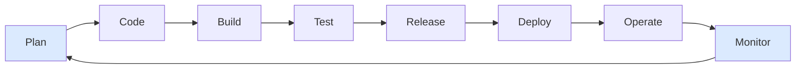

The old model has developers "throw code over a wall" to operations. DevOps removes that wall. But notice the gap: **where is security in this loop?** For years the answer was "at the very end, if at all" — which is the problem DevSecOps solves.

## 1.2 The problem: security as an afterthought

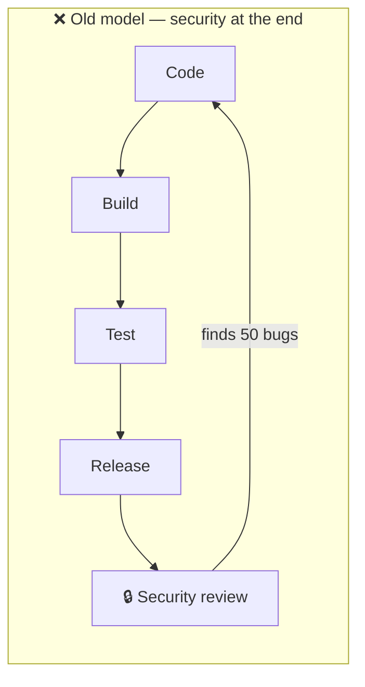

> 💡 **Plain-English:** Finding a security bug *after* release is like finding a crack in a building's foundation *after* 10 floors are built on top. A bug caught while coding might cost ₹100 to fix; the same bug in production can cost **30–100×** more — and a breach can cost crores plus reputation.

## 1.3 What is DevSecOps?

> **DevSecOps = building security *into* every stage of DevOps, automatically, as a shared responsibility — not a final gate.**

The motto is **"shift security left."** *Left* means earlier in the timeline — catch issues while writing code, not after shipping.

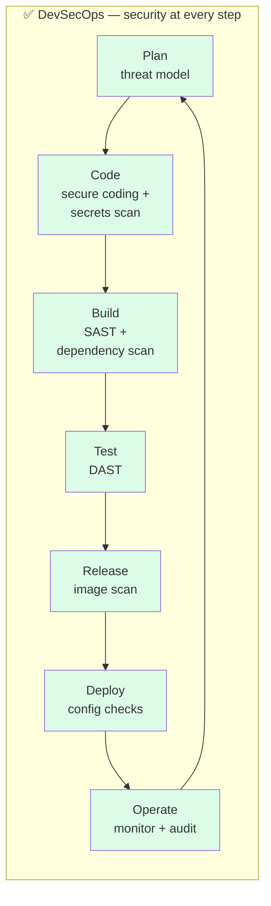

This diagram maps directly onto the four days: Day 1 covers **Code + Build + Test** (secure coding, SAST, DAST); Day 2 covers dependency scanning and secrets; Day 3 covers containers and compliance; Day 4 wires it all together.

## 1.4 The three pillars: People, Process, Technology

| Pillar | What it means | Example |
|---|---|---|
| 👥 **People (Culture)** | Security is *everyone's* job, not a separate team | Developers fix their own findings |
| 🔄 **Process** | Security is automated into the pipeline | The build *fails* if a critical CVE is found |
| 🛠 **Technology** | The tools that enforce it | SonarQube, ZAP, Trivy, Vault |

## 1.5 Why it matters — real breaches

| Breach | Root cause | Control that helps |
|---|---|---|
| **Equifax (2017)** | Unpatched known vulnerability in a library (Apache Struts) | **Dependency scanning** (Day 2) |
| **Log4Shell (2021)** | Critical flaw in the Log4j logging library | **Dependency + SAST** |
| **Countless leaks** | API keys/passwords committed to Git | **Secrets management** (Day 2) |
| **SolarWinds (2020)** | Compromised build pipeline | **Supply chain security** (Day 3) |

### 🧠 Check your understanding
1. In one sentence, what does "shift left" mean?
2. Whose responsibility is security in DevSecOps?
3. Name one breach and the control that would have prevented it.

---

# 📗 Module 2 — Secure Coding Practices

## 2.1 The core mindset: assume all input is hostile

Most vulnerabilities come from one mistake: **trusting data you don't control** — user input, file uploads, API responses, even data read back from your own database.

## 2.2 The core secure-coding principles

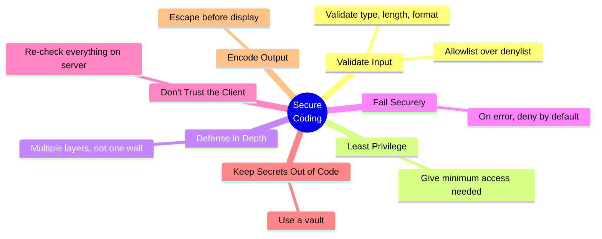

| Principle | One-line meaning | Quick example |
|---|---|---|
| **Validate input** | Check everything before using it | Reject a phone field containing letters |
| **Least privilege** | Give each part only the access it needs | DB user can read, not `DROP TABLE` |
| **Defense in depth** | Multiple layers; if one fails, another catches | Validate *and* use parameterized queries |
| **Fail securely** | When something errors, default to "deny" | Auth check throws → treat as logged-out |
| **Don't trust the client** | Browser/JS validation is UX, not security | Re-validate on the server, always |
| **Encode output** | Escape data before showing it | Display `<script>` as text, not run it |

## 2.3 Vulnerable vs Secure — side by side

**Example A — SQL query**

```javascript
// ❌ VULNERABLE — input is glued straight into the query
const sql = "SELECT * FROM users WHERE name = '" + name + "'";

// ✅ SECURE — parameterized query; the driver escapes input for you
db.all("SELECT * FROM users WHERE name = ?", [name]);
```

**Example B — showing user input on a page**

```javascript
// ❌ VULNERABLE — raw input rendered as HTML (XSS)
res.send("Hello " + req.query.name);

// ✅ SECURE — escape special characters before display
const escape = s => s.replace(/[&<>"']/g, c =>
  ({'&':'&amp;','<':'&lt;','>':'&gt;','"':'&quot;',"'":'&#39;'}[c]));
res.send("Hello " + escape(req.query.name));
```

The secure versions aren't harder — they're simply *correct*. Secure coding is mostly a set of habits, and the tools introduced later (SAST) flag the unsafe patterns automatically so those habits form quickly.

---

# 📗 Module 3 — OWASP Top 10 Basics

## 3.1 What is OWASP?

**OWASP** = **O**pen **W**orldwide **A**pplication **S**ecurity **P**roject — a non-profit that publishes free, vendor-neutral security guidance. Its most famous output is the **OWASP Top 10**: the ten most critical web-application security risks, updated every few years. It is the industry's shared vocabulary — security reports, SonarQube rules, and ZAP alerts all reference it.

## 3.2 The OWASP Top 10 (2021 edition)

```mermaid
flowchart TB
    A01[A01 Broken Access Control]
    A02[A02 Cryptographic Failures]
    A03[A03 Injection]
    A04[A04 Insecure Design]
    A05[A05 Security Misconfiguration]
    A06[A06 Vulnerable & Outdated Components]
    A07[A07 Identification & Auth Failures]
    A08[A08 Software & Data Integrity Failures]
    A09[A09 Logging & Monitoring Failures]
    A10[A10 Server-Side Request Forgery SSRF]
    style A01 fill:#fee2e2,stroke:#dc2626
    style A03 fill:#fee2e2,stroke:#dc2626
    style A06 fill:#fef9c3,stroke:#ca8a04
```

| # | Risk | Plain English | Example | Covered in |
|---|---|---|---|---|
| **A01** | Broken Access Control | Users do things they shouldn't be allowed to | Changing `?id=1` to `?id=2` to see another user's data | Secure coding |
| **A02** | Cryptographic Failures | Weak/missing encryption of sensitive data | Passwords stored as MD5 (our app!) | Module 4 |
| **A03** | **Injection** | Untrusted input changes a command/query | SQL injection (our app!), XSS | Module 4, SAST |
| **A04** | Insecure Design | The design itself is flawed | No rate-limit on login → brute force | Threat modelling |
| **A05** | Security Misconfiguration | Insecure default settings left on | Debug mode on in production | Day 3 compliance |
| **A06** | Vulnerable Components | Using libraries with known flaws | Old Log4j | **Day 2** dependency scan |
| **A07** | Auth Failures | Weak login / session handling | No MFA, predictable session IDs | Module 4 |
| **A08** | Integrity Failures | Trusting unverified code/data | Unsigned auto-updates | Day 3 supply chain |
| **A09** | Logging & Monitoring Failures | Cannot detect or investigate attacks | No audit logs | Day 3 auditing |
| **A10** | SSRF | Server tricked into calling internal systems | App fetches an attacker-supplied URL | Secure coding |

Every Top 10 item maps to something practised this week. By the end of the program you will have fixed real instances of A02, A03, A06, and A09 by hand.

## 3.3 Exploit two of these in the sample app

> 🧪 **Lab 3.1 — A03 Injection (SQL injection)**
> With VulnPortal running, enter this in the browser URL bar:
> ```
> http://localhost:3000/search?q=' OR '1'='1
> ```
> **What happens:** the query becomes `... WHERE name = '' OR '1'='1'` — always true — so it returns rows it shouldn't. That is SQL injection.

> 🧪 **Lab 3.2 — A03 Injection (Reflected XSS)**
> Enter:
> ```
> http://localhost:3000/search?q=<script>alert('XSS')</script>
> ```
> **What happens:** the browser pops an alert box because the app echoes raw HTML. An attacker could steal cookies instead of popping a harmless alert.

> 🧯 **If the alert doesn't pop:** some browsers block inline alerts; try ``, or view page source to confirm the `<script>` is reflected unescaped.

---

# 📗 Module 4 — Input Validation, Secure Authentication & Encryption Basics

## 4.1 Input Validation

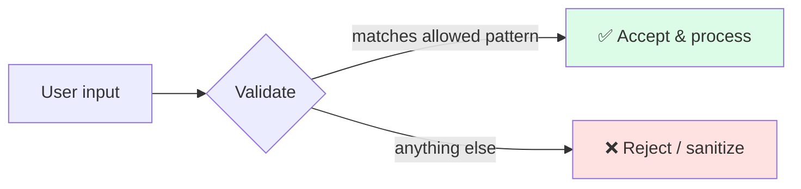

**Allowlist (good) vs Denylist (weak):**

| Approach | Idea | Why |
|---|---|---|
| ✅ **Allowlist** | Define what's *allowed*, reject everything else | Attackers can't predict your "allowed" set |
| ❌ **Denylist** | List what's *banned*, allow the rest | You'll always miss a sneaky variation |

```javascript
// ✅ Allowlist example: username = letters/digits/underscore, 3-20 chars
const isValidUsername = (u) => /^[A-Za-z0-9_]{3,20}$/.test(u);
if (!isValidUsername(req.body.username)) return res.status(400).send("Invalid username");
```

> 💡 **Validate on the server, always.** Client-side checks are for user convenience; an attacker bypasses the browser entirely with tools like `curl` or Burp (seen in Module 6).

## 4.2 Secure Authentication

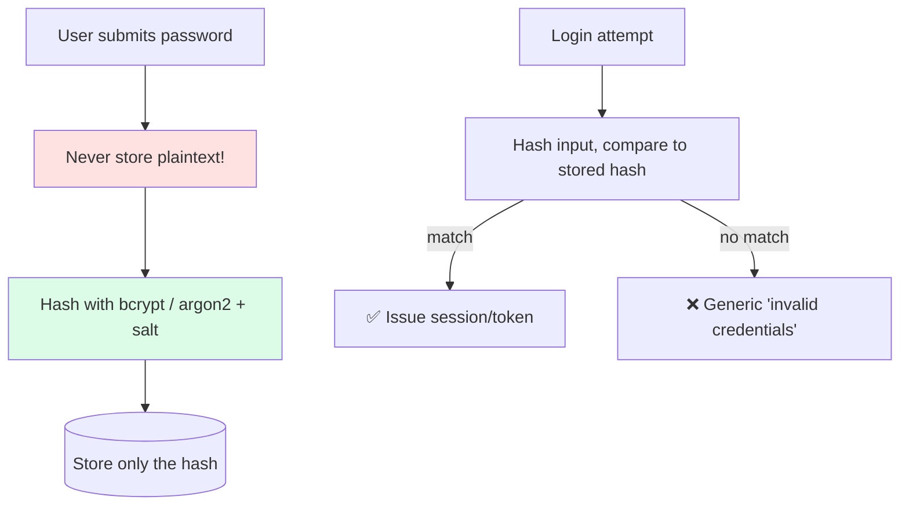

**Key rules:**

| Rule | Why |
|---|---|
| Never store plaintext passwords | One DB leak exposes everyone |
| Use **bcrypt / argon2 / scrypt**, not MD5/SHA-1 | They're *slow by design* → brute force is impractical |
| Always add a **salt** (these algorithms do it automatically) | Stops "rainbow table" precomputed attacks |
| Use **MFA** for sensitive systems | A stolen password alone isn't enough |
| Generic error: *"invalid username or password"* | Don't reveal which part was wrong |
| Set secure session cookies (`HttpOnly`, `Secure`, `SameSite`) | Stops cookie theft via XSS |

```javascript
// ✅ Secure password hashing with bcrypt
const bcrypt = require('bcrypt');
const hash = await bcrypt.hash(plainPassword, 12);   // store this
const ok   = await bcrypt.compare(loginInput, hash); // returns true/false
```

VulnPortal uses MD5 — that is OWASP **A02, Cryptographic Failures**. MD5 of `admin123` can be reversed in milliseconds via a lookup. bcrypt with a cost factor of 12 makes that attack impractical.

## 4.3 Encryption Basics

> 💡 **Two operations people confuse:**
> - **Hashing** = one-way fingerprint. It *cannot* be reversed. Use for **passwords** and **integrity**.
> - **Encryption** = two-way. It *can* be decrypted with a key. Use for **data you need to read back** (e.g., a stored token).

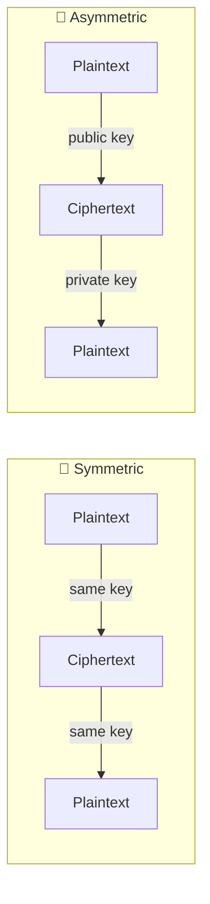

| Concept | Meaning | Everyday example |
|---|---|---|
| **Symmetric** (AES) | One shared key encrypts & decrypts | Encrypting files on disk |
| **Asymmetric** (RSA/ECC) | Public key encrypts, private key decrypts | HTTPS handshake, signing |
| **Hashing** (SHA-256, bcrypt) | One-way fingerprint | Password storage, file integrity |
| **TLS / HTTPS** | Encryption *in transit* | The padlock 🔒 in the browser |
| **Encryption at rest** | Encryption of stored data | Encrypted database / disk |

> 💡 **Rule of thumb:** passwords are **hashed** (bcrypt), everything else sensitive is **encrypted** (AES), and everything travels over **TLS**.

### 🧠 Check your understanding
1. Should a password be hashed or encrypted? *(Hash.)*
2. Which is reversible — hashing or encryption? *(Encryption.)*
3. Why is bcrypt better than MD5 for passwords? *(Slow by design + salted.)*

---

# 📕 Module 5 — Static Code Analysis (SAST)

## 5.1 What is SAST?

**SAST = Static Application Security Testing.** It analyses **source code (not running)** to find vulnerabilities — like a spell-checker for security. *Static* = the application is "at rest"; code is read, not executed.

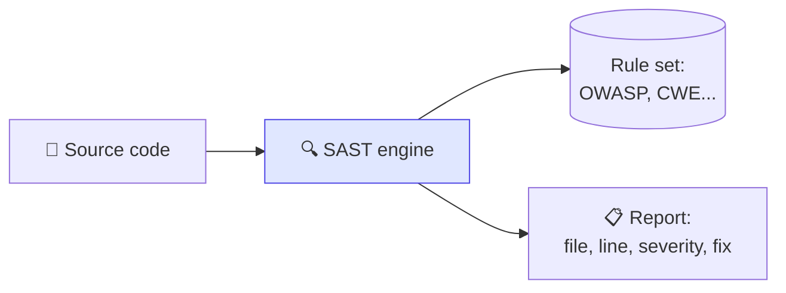

## 5.2 SAST vs DAST

| | 🔵 **SAST** (Module 5) | 🟢 **DAST** (Module 6) |
|---|---|---|
| Looks at | Source code (inside) | Running app (outside) |
| App running? | No | Yes |
| Analogy | Reading the blueprint | Trying to break into the building |
| Finds | Insecure code patterns, hardcoded secrets | Runtime flaws, misconfig, real exploits |
| Needs | The code | A URL |
| When in pipeline | Early (on commit/build) | Later (on a deployed test env) |
| Tools | **SonarQube**, Checkmarx | **OWASP ZAP**, Burp Suite |

> 💡 **They're complementary, not rivals.** SAST sees the recipe; DAST tastes the dish. Both are needed.

## 5.3 The tools: SonarQube & Checkmarx

| Tool | Type | Notes |
|---|---|---|
| **SonarQube** | Open-source (Community Edition free) | Used hands-on here; runs in Docker |
| **Checkmarx (CxSAST)** | Commercial / enterprise | Common in large firms; covered conceptually |

### 🧪 Lab 5.1 — Run SonarQube locally with Docker

```bash
# 1) Start a SonarQube server (Community Edition)
docker run -d --name sonarqube -p 9000:9000 sonarqube:community

# 2) Wait ~2 minutes, then open the dashboard
#    http://localhost:9000
#    Default login:  admin / admin   (it forces a password change)
```

> ✅ **Expected:** the SonarQube web UI loads at `http://localhost:9000`.
> 🧯 **If it won't start / exits:** SonarQube needs RAM. On Linux set `sysctl -w vm.max_map_count=262144`. In Docker Desktop, allocate Docker ≥4 GB RAM under Settings → Resources.

### 🧪 Lab 5.2 — Create a project & token

1. SonarQube UI → **Create Project** → *Manually* → key & name `vulnportal`.
2. Choose **Locally**.
3. Generate an **analysis token** (a long string) and copy it.

### 🧪 Lab 5.3 — Scan VulnPortal with the SonarScanner

The scanner also runs in Docker, so nothing extra is installed:

```bash
# Run from INSIDE the vulnportal folder
docker run --rm \
  -e SONAR_HOST_URL="http://host.docker.internal:9000" \
  -e SONAR_TOKEN="PASTE_YOUR_TOKEN_HERE" \
  -v "$(pwd):/usr/src" \
  sonarsource/sonar-scanner-cli \
  -Dsonar.projectKey=vulnportal
```

> 🧯 **Linux note:** `host.docker.internal` may not resolve. Either add `--add-host=host.docker.internal:host-gateway`, or use the machine's LAN IP, or run with `--network host` and `SONAR_HOST_URL=http://localhost:9000`.
> 🪟/🍎 **Windows/Mac:** `host.docker.internal` works out of the box.

### 🧪 Lab 5.4 — Read the results & fix them

Open `http://localhost:9000` → project `vulnportal` → **Issues** tab. Expect findings such as:

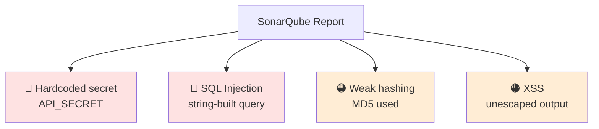

Now fix the code. Replace the vulnerable parts of `app.js`:

```javascript
// ✅ FIX 1: remove hardcoded secret — read from environment
const API_SECRET = process.env.API_SECRET; // set outside code (Day 2: a vault)

// ✅ FIX 2: parameterized query (no SQL injection)
// ✅ FIX 4: escape output (no XSS)
const escape = s => String(s).replace(/[&<>"']/g, c =>
  ({'&':'&amp;','<':'&lt;','>':'&gt;','"':'&quot;',"'":'&#39;'}[c]));

app.get('/search', (req, res) => {
  const q = req.query.q || '';
  db.all("SELECT name FROM users WHERE name = ?", [q], (err, rows) => {
    res.send("You searched for: " + escape(q) +
             "<br>Result: " + escape(JSON.stringify(rows || [])));
  });
});

// ✅ FIX 3: replace MD5 with bcrypt (npm install bcrypt)
// Use inside an async context, e.g. the seed step:
//   const hashed = await bcrypt.hash('admin123', 12);
```

> 🧪 **Re-scan** (repeat Lab 5.3) and watch the issue count drop. Proving a fix worked is the core of DevSecOps.

## 5.4 Checkmarx (conceptual)

Many enterprises license **Checkmarx (CxSAST / Checkmarx One)**. It is not installed here, but the workflow is the same idea as SonarQube:

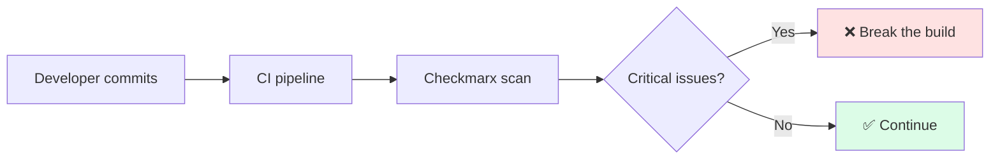

| Feature | SonarQube CE | Checkmarx |
|---|---|---|
| Cost | Free | Commercial |
| Strength | Code quality + security, easy setup | Deep security focus, low false positives, enterprise governance |
| Where it's met | Learning, small/mid projects | Large client engagements |

---

# 📕 Module 6 — Dynamic Code Analysis (DAST)

## 6.1 What is DAST?

**DAST = Dynamic Application Security Testing.** It tests the **running application from the outside**, like an attacker would — sending malicious requests and watching the responses. No source code is needed, only a URL.

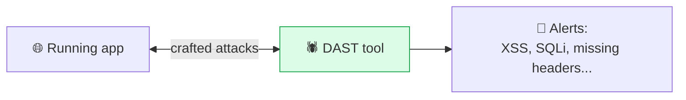

## 6.2 The tools: OWASP ZAP & Burp Suite

| Tool | License | Best for |
|---|---|---|
| **OWASP ZAP** | Free, open-source | Automated scans, CI integration — the main tool here |
| **Burp Suite** | Community (free) / Pro (paid) | Manual testing: intercept & tamper with requests |

### 🧪 Lab 6.1 — Automated scan with OWASP ZAP (Docker)

Ensure VulnPortal is running (`node app.js`), then:

```bash
# ZAP baseline scan against the app (passive + light active checks)
docker run --rm -t \
  --add-host=host.docker.internal:host-gateway \
  ghcr.io/zaproxy/zaproxy:stable \
  zap-baseline.py -t http://host.docker.internal:3000 -I
```

> ✅ **Expected:** ZAP prints a list of alerts — likely **Cross-Site Scripting (Reflected)**, **missing security headers** (`Content-Security-Policy`, `X-Content-Type-Options`), and more. The `-I` flag means "do not fail the run on warnings."

> 🧯 **If `host.docker.internal` fails on Linux:** use `--network host` and target `http://localhost:3000`, or use the LAN IP.

**GUI alternative (very visual):** install ZAP desktop → enter `http://localhost:3000` in the **Automated Scan** box → **Attack** → watch the **Alerts** tab populate in real time with red/orange flags.

### 6.3 Reading ZAP alerts

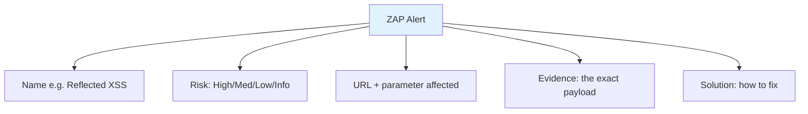

ZAP finds the *same XSS* that SonarQube found — but from the outside, with a real payload. SAST says "this line looks dangerous"; DAST proves "it is actually exploitable." Two angles on the same bug — which is why mature teams run both.

### 🧪 Lab 6.2 — Manual testing with Burp Suite Community

Burp excels at **intercepting and editing requests**, proving that client-side validation is not security.

1. Open **Burp Suite Community** → use its built-in browser (**Proxy → Open Browser**).
2. Browse to `http://localhost:3000/search?q=test`.
3. **Proxy → Intercept is ON** → make a request → Burp pauses it.
4. **Right-click → Send to Repeater.**
5. In **Repeater**, change `q=test` to `q=' OR '1'='1` → **Send** → observe the response change.

> 💡 **The lesson:** the browser is just one client. Burp can send *anything* directly to the server, so **all validation must happen server-side** — which connects straight back to Module 4.

---

# 🏁 Capstone Lab — Find → Fix → Re-scan

This is the heart of Day 1: completing the full DevSecOps loop on one application.

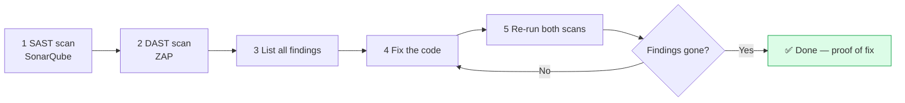

### 📋 Capstone checklist

- [ ] Run SonarQube on VulnPortal — record the issue count.
- [ ] Run ZAP baseline on the running app — record the alert count.
- [ ] Fix **all four** known vulnerabilities (SQLi, XSS, hardcoded secret, MD5).
- [ ] Re-run **both** scans.
- [ ] Capture a **before/after** screenshot of the counts.
- [ ] Write 2 lines per vulnerability: *what it was* and *how it was fixed*.

> ✅ **Success criteria:** the SonarQube high-severity count and the ZAP high-risk count both drop to near zero, and each fix can be explained in plain English.

---

# 📝 Day 1 Assignment

1. **Reflection (½ page):** In your own words, what is DevSecOps and what does "shift left" mean? Give one real breach example and the control that would have stopped it.
2. **Vulnerability table:** For each of the 4 VulnPortal vulnerabilities, complete a table: *OWASP category · what an attacker could do · the fix · the secure-coding principle it uses.*
3. **SAST vs DAST:** Write 5 differences between SAST and DAST in your own words.
4. **Bonus (optional):** Run **OWASP Juice Shop** (`docker run -d -p 3001:3000 bkimminich/juice-shop`) and run a ZAP baseline scan against it. List the 3 highest-risk alerts.

---

# 💼 Use Cases / Discussion Prompts

| Scenario | Discuss |
|---|---|
| A developer hardcodes an AWS key to "just test quickly" and pushes to GitHub. | What can go wrong in minutes? What control catches it? *(Secrets scanning — Day 2.)* |
| A client application stores passwords as SHA-1. | Which OWASP category? How is migration done safely without locking out users? |
| The security team wants to block releases on critical findings, but developers say it slows them down. | How is speed balanced against security? *(The core DevSecOps culture question.)* |

---

# 🧪 Day 1 Mini-Assessment

1. Define DevSecOps in one sentence.
2. "Shift left" means doing security ______ in the lifecycle.
3. Name 3 of the OWASP Top 10.
4. SQL injection belongs to which OWASP category?
5. Should passwords be hashed or encrypted?
6. Why is bcrypt preferred over MD5?
7. SAST analyses ______; DAST analyses ______.
8. Name one SAST tool and one DAST tool.
9. Why must input validation happen on the server, not just the browser?
10. What does parameterizing a query prevent?

<details>
<summary>📋 Answer key</summary>

1. Building security into every DevOps stage as a shared, automated responsibility.
2. earlier
3. e.g., Broken Access Control, Cryptographic Failures, Injection.
4. A03: Injection.
5. Hashed.
6. It's deliberately slow + salted, making brute force impractical.
7. source code; the running application.
8. SAST: SonarQube/Checkmarx · DAST: ZAP/Burp.
9. Attackers bypass the browser entirely (curl/Burp), so client checks aren't security.
10. SQL injection (input is treated as data, never as part of the SQL command).
</details>

---

# 🧾 Day 1 Command Cheat-Sheet

```bash
# Verify environment
git --version && docker --version && node --version

# Run the sample app
node app.js                               # http://localhost:3000

# SonarQube server
docker run -d --name sonarqube -p 9000:9000 sonarqube:community

# SonarScanner (from project folder)
docker run --rm -e SONAR_HOST_URL="http://host.docker.internal:9000" \
  -e SONAR_TOKEN="TOKEN" -v "$(pwd):/usr/src" \
  sonarsource/sonar-scanner-cli -Dsonar.projectKey=vulnportal

# OWASP ZAP baseline scan
docker run --rm -t --add-host=host.docker.internal:host-gateway \
  ghcr.io/zaproxy/zaproxy:stable \
  zap-baseline.py -t http://host.docker.internal:3000 -I

# Bonus target: OWASP Juice Shop
docker run -d -p 3001:3000 bkimminich/juice-shop
```

---

# 📚 Glossary

| Term | Meaning |
|---|---|
| **DevSecOps** | Integrating security into every stage of DevOps |
| **Shift left** | Doing security earlier in the lifecycle |
| **SAST** | Static testing — analyses source code |
| **DAST** | Dynamic testing — attacks the running app |
| **OWASP** | Non-profit publishing the Top 10 web risks |
| **Injection** | Untrusted input altering a query/command |
| **XSS** | Cross-Site Scripting — running attacker JS in a victim's browser |
| **CVE** | Common Vulnerabilities and Exposures — a public ID for a known flaw |
| **CWE** | Common Weakness Enumeration — categories of coding weaknesses |
| **Salt** | Random data added before hashing to defeat rainbow tables |
| **TLS** | Transport Layer Security — encryption in transit (HTTPS) |
| **False positive** | A reported "issue" that isn't actually exploitable |

---

# ➡️ Coming Up — Day 2 Preview

Day 2 secures the *supply chain* of VulnPortal:

- **Dependency Scanning** — Snyk & OWASP Dependency-Check (catching vulnerable libraries → OWASP A06)
- **Secrets Management** — why secrets never belong in code, and migrating that `API_SECRET` into **HashiCorp Vault / AWS Secrets Manager**
- **Hands-on:** integrate Snyk into a CI pipeline; move hardcoded credentials into a real vault.

---

<div align="center">

**End of Day 1**
*Foundations · Secure Coding · OWASP Top 10 · SAST · DAST*

</div>
