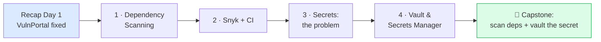
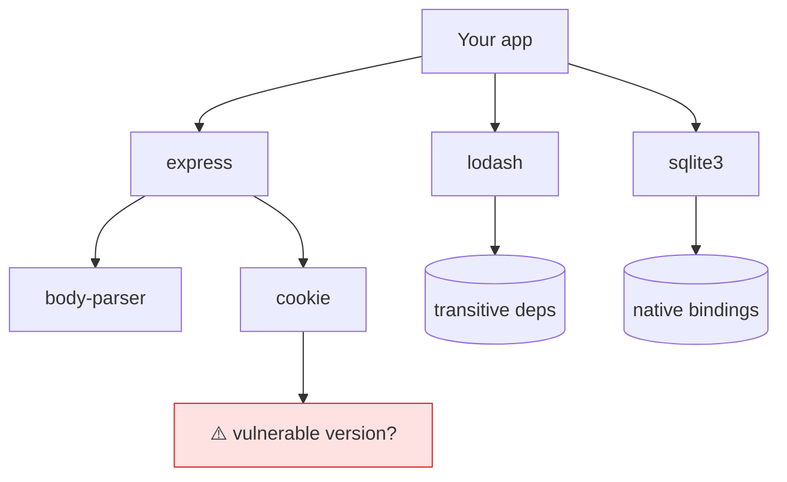
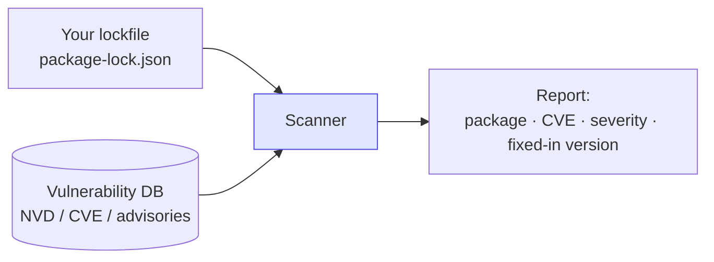
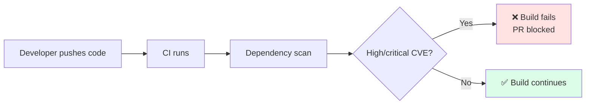
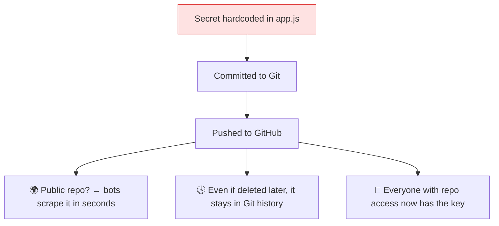
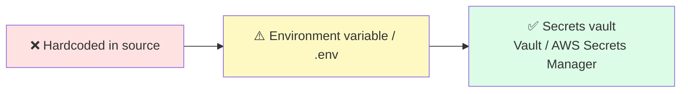
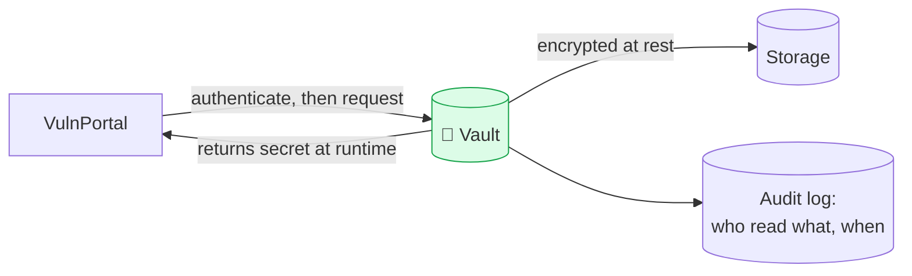
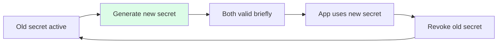
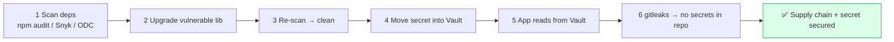

<div align="center">

<svg width="760" height="150" viewBox="0 0 760 150" xmlns="http://www.w3.org/2000/svg" role="img" aria-label="DevSecOps Day 2 banner">
  <defs>
    <linearGradient id="g2" x1="0" y1="0" x2="1" y2="1">
      <stop offset="0%" stop-color="#065f46"/>
      <stop offset="100%" stop-color="#10b981"/>
    </linearGradient>
  </defs>
  <rect x="0" y="0" width="760" height="150" rx="16" fill="url(#g2)"/>
  <g transform="translate(58,33)" stroke="#ffffff" stroke-width="4" fill="none" opacity="0.95">
    <rect x="6" y="40" width="22" height="22" rx="3" fill="#ffffff" opacity="0.18"/>
    <rect x="40" y="40" width="22" height="22" rx="3" fill="#ffffff" opacity="0.18"/>
    <rect x="23" y="8" width="22" height="22" rx="3" fill="#ffffff" opacity="0.18"/>
    <path d="M34 30 v6 M17 40 v-4 h34 v4" />
  </g>
  <text x="160" y="62" font-family="Segoe UI, Arial, sans-serif" font-size="34" font-weight="700" fill="#ffffff">DevSecOps Intensive</text>
  <text x="160" y="96" font-family="Segoe UI, Arial, sans-serif" font-size="20" fill="#d1fae5">Day 2 — Dependency Scanning &amp; Secrets Management</text>
  <text x="160" y="124" font-family="Segoe UI, Arial, sans-serif" font-size="14" fill="#a7f3d0">Hands-on study material</text>
</svg>

</div>

# 📘 Day 2 — Dependency Scanning + Secrets Management

> **Program:** 4-Day DevSecOps Hands-on Training
> **Mode:** Fully practical, lab-driven
> **Scope of Day 2:** Dependency scanning (Snyk, OWASP Dependency-Check) · Identifying vulnerable libraries · Why secrets must not live in code · Secrets management (HashiCorp Vault, AWS Secrets Manager) · Secure storage & rotation · Integrating a scan into a CI pipeline · Migrating hardcoded credentials into a vault

---

## 🎯 Day 2 Learning Outcomes

After completing Day 2 you will be able to:

1. Explain why **most vulnerabilities come from third-party libraries**, not your own code (OWASP A06).
2. Run **dependency scans** with `npm audit`, **Snyk**, and **OWASP Dependency-Check**, and read the reports.
3. Understand how a **CI pipeline** automatically blocks builds that contain vulnerable libraries.
4. Explain why **secrets must never be committed to code** and how leaks happen.
5. Store and retrieve secrets with **HashiCorp Vault**, and understand **AWS Secrets Manager**.
6. **Migrate the hardcoded `API_SECRET`** from VulnPortal into a vault and remove it from code.
7. Understand **secret rotation** and **secret scanning** (gitleaks).

---

## 🗺 Day 2 Roadmap



> 🔁 **Where we are:** On Day 1 we fixed VulnPortal's own code (SQLi, XSS, weak hashing) and removed the hardcoded secret from the source. Today we tackle two things that source-code fixes alone can't solve: the **libraries we depend on**, and **where the secret actually lives**.

---

# 🔧 Prerequisites & Lab Setup

Everything from Day 1 is reused (Docker, Node.js, the VulnPortal project). Day 2 adds two tools.

> [!IMPORTANT]
> **🖥 Shell & path differences — read this first.** Docker commands that touch the file system or environment are shown for both **🐧 Linux/macOS** (bash) and **🪟 Windows CMD**. Commands not shown twice (e.g. `git`, `npm`, `node`, single-line `docker build`) are identical on both platforms. The differences are purely mechanical:
>
> | Concept | 🐧 Linux / macOS (bash) | 🪟 Windows (CMD) |
> |---|---|---|
> | Current folder | `$(pwd)` | `%cd%` |
> | Multi-line command | end each line with `\` | keep it on **one line** |
> | Set a variable | `export VAR=value` | `set VAR=value` |
> | Read a variable | `$VAR` | `%VAR%` |
> | Last exit code | `echo $?` | `echo %errorlevel%` |
> | Mount the Docker socket | `/var/run/docker.sock` | `//var/run/docker.sock` |
> | `host.docker.internal` | add `--add-host=host.docker.internal:host-gateway` | works natively — omit the flag |
>
> **PowerShell** users: current folder is `${PWD}`, variables are `$env:VAR`.

| Tool | Purpose | Install |
|---|---|---|
| **Snyk CLI** | Scan dependencies for known CVEs | `npm install -g snyk` |
| **OWASP Dependency-Check** | Open-source dependency scanner (via Docker) | `docker pull owasp/dependency-check` |
| **HashiCorp Vault** | Store & serve secrets (via Docker) | `docker pull hashicorp/vault` |
| **gitleaks** | Scan a repo for committed secrets (via Docker) | `docker pull zricethezav/gitleaks` |

> 🧯 **Snyk needs a free account.** `snyk auth` opens a browser to log in (GitHub/Google/email). No credit card. If the browser flow fails on a lab machine, run `snyk auth <API_TOKEN>` using the token from the Snyk account settings page.

### 🧪 Lab 0 — Introduce a *known-vulnerable* dependency

To have something real to find, add an old library version with a published CVE to VulnPortal:

```bash
cd vulnportal
npm install [email protected]   # old version with known prototype-pollution issues
```

> 💡 **Why deliberately install something old?** It guarantees the scanners report a finding so the workflow can be practised. In real projects you never pin to a vulnerable version on purpose — the scanner exists to *stop* you from doing so accidentally.

---

# 📗 Module 1 — Dependency Scanning

## 1.1 The core idea: you don't write most of your code

A modern Node.js (or Java, or Python) app is **mostly other people's code**. Installing one package pulls in dozens of *transitive* dependencies. If any one of them has a known vulnerability, your app inherits it.



> 💡 **OWASP A06 — Vulnerable & Outdated Components.** This is exactly how the **Equifax (2017)** and **Log4Shell (2021)** breaches happened: a single known-vulnerable library in the dependency tree.

## 1.2 What a dependency scanner does



It compares every installed package+version against a database of **known vulnerabilities** (CVEs) and tells you which to upgrade.

## 1.3 Tool 1 — `npm audit` (built in, free, always available)

```bash
cd vulnportal
npm audit                 # human-readable report
npm audit --json          # machine-readable (for CI)
npm audit fix             # auto-upgrade where a safe fix exists
npm audit fix --force     # also apply breaking upgrades (use with care)
```

> ✅ **Expected:** a table listing vulnerable packages, severity (low/moderate/high/critical), the path, and the version that fixes it.

## 1.4 Tool 2 — Snyk

Snyk has a richer database, suggests exact fixes, and integrates with CI and Git.

```bash
# One-time login
snyk auth

# Test the current project against Snyk's vulnerability DB
snyk test

# Continuously monitor the project (uploads a snapshot to your Snyk dashboard)
snyk monitor
```

> ✅ **Expected (`snyk test`):** each issue shows the **package**, **severity**, the **CVE/CWE**, an **explanation**, and **"Upgrade to X to fix."**

| Command | What it does |
|---|---|
| `snyk test` | One-off scan, exits non-zero if issues found (good for CI gates) |
| `snyk monitor` | Records the project so you're alerted when *new* CVEs are disclosed later |
| `snyk test --severity-threshold=high` | Only fail on high/critical (reduce noise) |

## 1.5 Tool 3 — OWASP Dependency-Check (open-source)

A free, self-hosted scanner that produces an HTML report. It runs well in Docker:

**🐧 Linux / macOS**
```bash
cd vulnportal
mkdir -p odc-data odc-report
docker run --rm \
  -v "$(pwd):/src" \
  -v "$(pwd)/odc-data:/usr/share/dependency-check/data" \
  owasp/dependency-check \
  --scan /src --format HTML --project "VulnPortal" --out /src/odc-report
# Open odc-report/dependency-check-report.html in a browser
```
**🪟 Windows (CMD)**
```bat
cd vulnportal
mkdir odc-data & mkdir odc-report
docker run --rm -v "%cd%:/src" -v "%cd%/odc-data:/usr/share/dependency-check/data" owasp/dependency-check --scan /src --format HTML --project "VulnPortal" --out /src/odc-report
REM Open odc-report\dependency-check-report.html in a browser
```

> 🧯 **First run is slow.** Dependency-Check downloads the NVD (National Vulnerability Database) on first use. Mounting `odc-data` caches it so later runs are fast. For faster, more reliable downloads, get a free **NVD API key** and pass `--nvdApiKey <KEY>`.

## 1.6 Comparing the three

| | `npm audit` | **Snyk** | **OWASP Dependency-Check** |
|---|---|---|---|
| Cost | Free | Free tier + paid | Free / open-source |
| Ecosystems | npm only | Many (npm, Maven, PyPI, Go…) | Many (Java, .NET, npm…) |
| Fix advice | Basic | Detailed, exact upgrades | CVE references |
| Best for | Quick local check | CI + Git + dashboards | Self-hosted, no vendor account |

### 🧠 Check your understanding
1. What is a *transitive* dependency?
2. Which OWASP category covers vulnerable libraries?
3. Which command makes a build *fail* when a high-severity CVE is present?

---

# 📗 Module 2 — Integrating Dependency Scanning into CI

## 2.1 Why scan in CI?

Running a scan once on a laptop helps once. Running it **automatically on every push** means a vulnerable library can *never* reach production unnoticed. This is "shift-left," automated.



## 2.2 Lab — Add a dependency scan to a CI pipeline

The example below uses **GitHub Actions** (the same idea applies to GitLab CI, Jenkins, Azure DevOps). Create `.github/workflows/security.yml` in the project:

```yaml
name: Security Scan
on: [push, pull_request]

jobs:
  dependency-scan:
    runs-on: ubuntu-latest
    steps:
      - uses: actions/checkout@v4

      - uses: actions/setup-node@v4
        with:
          node-version: 20

      - name: Install dependencies
        run: npm ci

      # Free baseline gate — fails on high+ severity
      - name: npm audit
        run: npm audit --audit-level=high

      # Snyk gate (needs SNYK_TOKEN saved as a repo secret)
      - name: Snyk test
        uses: snyk/actions/node@master
        env:
          SNYK_TOKEN: ${{ secrets.SNYK_TOKEN }}
        with:
          args: --severity-threshold=high
```

> 💡 **Note the irony:** the pipeline itself needs a secret (`SNYK_TOKEN`). It is stored in **GitHub repo secrets**, *not* in the YAML — which is exactly the principle of Module 3.

> 🧯 **`npm ci` vs `npm install`:** CI uses `npm ci`, which installs the exact versions from `package-lock.json` and fails if the lockfile is out of sync — reproducible builds.

---

# 📗 Module 3 — Secrets Management: The Problem

## 3.1 What is a "secret"?

Any credential that grants access: API keys, database passwords, tokens, private keys, encryption keys. VulnPortal's `API_SECRET` is one.

## 3.2 Why secrets must never be in code



> 💡 **The hard truth about Git history:** deleting a secret in a new commit does **not** remove it — the old commit still contains it. The only safe response to a leaked secret is to **rotate (revoke and reissue) it immediately.**

## 3.3 The progression from bad to good



| Stage | Pros | Cons |
|---|---|---|
| ❌ Hardcoded | none | leaks via Git, visible to all |
| ⚠️ `.env` file + `dotenv` | out of source if `.gitignore`'d | still plaintext on disk, no rotation, easy to commit by mistake |
| ✅ Secrets vault | central, encrypted, access-controlled, audited, rotatable | needs setup |

## 3.4 Catch leaks automatically — secret scanning with gitleaks

**🐧 Linux / macOS**
```bash
# Scan the whole git history of the current repo for committed secrets
docker run --rm -v "$(pwd):/repo" zricethezav/gitleaks:latest \
  detect --source=/repo -v
```
**🪟 Windows (CMD)**
```bat
docker run --rm -v "%cd%:/repo" zricethezav/gitleaks:latest detect --source=/repo -v
```

> ✅ **Expected:** if the original Day-1 `API_SECRET` was ever committed, gitleaks flags it with the file, commit, and line. Add gitleaks to CI to block future secret commits.

---

# 📗 Module 4 — Vault & AWS Secrets Manager

## 4.1 HashiCorp Vault — concept

Vault is a central service that **stores secrets encrypted** and hands them out only to authorized callers, logging every access.



### 🧪 Lab 4.1 — Run Vault in dev mode

> ⚠️ **Dev mode is for learning only** — it runs in memory, unsealed, with a known root token. Never use dev mode in production.

**🐧 Linux / macOS**
```bash
docker run --rm -d --name vault \
  --cap-add=IPC_LOCK \
  -e 'VAULT_DEV_ROOT_TOKEN_ID=root' \
  -p 8200:8200 \
  hashicorp/vault

# Point the CLI / app at this Vault
export VAULT_ADDR='http://127.0.0.1:8200'
export VAULT_TOKEN='root' 
```
**🪟 Windows (CMD)**
```bat
docker run --rm -d --name vault --cap-add=IPC_LOCK -e "VAULT_DEV_ROOT_TOKEN_ID=root" -p 8200:8200 hashicorp/vault

REM Point the CLI / app at this Vault
set VAULT_ADDR=http://127.0.0.1:8200
set VAULT_TOKEN=root
```

> ✅ **Expected:** the Vault UI is reachable at `http://localhost:8200` (token: `root`).

### 🧪 Lab 4.2 — Store and read the secret

Using the CLI inside the container (or a local `vault` binary):

**🐧 Linux / macOS**
```bash
# Write the secret into Vault's key-value store
docker exec -e VAULT_ADDR='http://127.0.0.1:8200' -e VAULT_TOKEN='root' vault \
  vault kv put secret/vulnportal api_secret="S3cr3t-Pa55w0rd-DoNotCommit"

# Read it back
docker exec -e VAULT_ADDR='http://127.0.0.1:8200' -e VAULT_TOKEN='root' vault \
  vault kv get secret/vulnportal
```
**🪟 Windows (CMD)**
```bat
docker exec -e VAULT_ADDR=http://127.0.0.1:8200 -e VAULT_TOKEN=root vault vault kv put secret/vulnportal api_secret="S3cr3t-Pa55w0rd-DoNotCommit"
docker exec -e VAULT_ADDR=http://127.0.0.1:8200 -e VAULT_TOKEN=root vault vault kv get secret/vulnportal
```

> ✅ **Expected:** Vault echoes the stored key/value. The secret now lives in Vault, not in `app.js`.

### 🧪 Lab 4.3 — Make VulnPortal read the secret from Vault at runtime

```bash
cd vulnportal
npm install node-vault
```

Replace the hardcoded line in `app.js`:

```javascript
// ❌ OLD: const API_SECRET = "S3cr3t-Pa55w0rd-DoNotCommit";

// ✅ NEW: fetch the secret from Vault at startup
const vault = require('node-vault')({
  endpoint: process.env.VAULT_ADDR,   // http://127.0.0.1:8200
  token: process.env.VAULT_TOKEN      // injected by the environment, never hardcoded
});

let API_SECRET;
async function loadSecrets() {
  const res = await vault.read('secret/data/vulnportal'); // KV v2 path
  API_SECRET = res.data.data.api_secret;
  console.log('Secret loaded from Vault (not from source code).');
}
loadSecrets();
```

> 💡 **Notice what happened:** the source code now contains *no secret at all* — only the *address* of where to ask for one, and the app proves its identity with a token supplied by the environment. The actual secret value never touches Git.

## 4.2 AWS Secrets Manager — concept

In cloud (and often at large firms), the managed equivalent is **AWS Secrets Manager** (Azure has Key Vault; GCP has Secret Manager). Same idea, fully managed, with **built-in automatic rotation**.

**🐧 Linux / macOS**
```bash
# Store a secret
aws secretsmanager create-secret \
  --name vulnportal/api_secret \
  --secret-string "S3cr3t-Pa55w0rd-DoNotCommit"

# Retrieve it
aws secretsmanager get-secret-value --secret-id vulnportal/api_secret
```
**🪟 Windows (CMD)**
```bat
aws secretsmanager create-secret --name vulnportal/api_secret --secret-string "S3cr3t-Pa55w0rd-DoNotCommit"
aws secretsmanager get-secret-value --secret-id vulnportal/api_secret
```

| | **HashiCorp Vault** | **AWS Secrets Manager** |
|---|---|---|
| Hosting | Self-managed (or HCP cloud) | Fully managed by AWS |
| Cloud lock-in | Cloud-agnostic | AWS only |
| Rotation | Configurable (dynamic secrets) | Built-in, scheduled |
| Audit | Full audit device | CloudTrail |
| Best for | Multi-cloud / on-prem | AWS-native stacks |

## 4.3 Secret rotation



**Rotation** = periodically replacing a secret so a leaked value has a short useful life. Managed services automate it; the key practices are: rotate on a schedule, rotate **immediately** after any suspected leak, and never reuse a secret across environments (dev/test/prod each get their own).

### 🧠 Check your understanding
1. Why isn't deleting a secret in a new commit enough?
2. What is the single safe response to a leaked credential? *(Rotate it.)*
3. Name one advantage of a vault over a `.env` file.

---

# 🏁 Capstone Lab — Secure the Supply Chain & the Secret

Bring Modules 1–4 together on VulnPortal.



### 📋 Capstone checklist
- [ ] Run `npm audit` / `snyk test` / OWASP Dependency-Check on VulnPortal — record the findings.
- [ ] Upgrade the deliberately-old `lodash` (`npm install lodash@latest`) and re-scan — confirm it clears.
- [ ] Add the dependency-scan step to the CI workflow file.
- [ ] Start Vault, store `api_secret`, and update `app.js` to read it at runtime.
- [ ] Confirm `app.js` contains **no secret value** — only the Vault address/path.
- [ ] Run gitleaks and confirm no secrets are detected in the working tree.

> ✅ **Success criteria:** dependency scan is clean (or only accepted low-severity items remain), the secret is served by Vault, and the source code is secret-free.

---

# 📝 Day 2 Assignment

1. **Dependency report:** Run all three scanners on VulnPortal. In a table, list each vulnerable package, its severity, the CVE, and the fixed version.
2. **CI explanation (½ page):** In your own words, why is scanning in CI stronger than scanning once on a laptop?
3. **Secrets essay (½ page):** Explain why a secret committed to Git is compromised even after it's "deleted," and what must be done.
4. **Vault task:** Show the commands you used to put and get a secret in Vault, and the `app.js` change that removed the hardcoded value.
5. **Bonus:** Add a **gitleaks** step to the CI workflow so future secret commits are blocked.

---

# 💼 Use Cases / Discussion Prompts

| Scenario | Discuss |
|---|---|
| A critical CVE is announced for a library you already shipped 3 months ago. | How would `snyk monitor` have helped vs a one-time scan? |
| A teammate's API key appears in a public GitHub repo. | What are the first three actions, in order? |
| The team wants zero secrets in any repo, forever. | Which two controls combined achieve this? *(Vault + gitleaks-in-CI.)* |
| A scanner reports 200 low-severity issues and the team is overwhelmed. | How do severity thresholds keep CI useful without ignoring real risk? |

---

# 🧪 Day 2 Mini-Assessment

1. What does OWASP A06 cover?
2. What is a transitive dependency?
3. Name three dependency-scanning tools.
4. Which flag makes Snyk fail only on high+ severity?
5. Why use `npm ci` instead of `npm install` in CI?
6. Why is a hardcoded secret still compromised after being deleted from code?
7. Name two secrets-management tools.
8. What does "rotating" a secret mean?
9. What does gitleaks do?
10. What is the one safe response to a leaked credential?

<details>
<summary>📋 Answer key</summary>

1. Vulnerable & outdated components (using libraries with known flaws).
2. A dependency pulled in indirectly by one of your direct dependencies.
3. `npm audit`, Snyk, OWASP Dependency-Check.
4. `--severity-threshold=high`.
5. It installs exact locked versions reproducibly and fails on lockfile drift.
6. The old commit in Git history still contains it.
7. HashiCorp Vault, AWS Secrets Manager (also Azure Key Vault, GCP Secret Manager).
8. Replacing it with a new value so a leaked one is short-lived.
9. Scans a repo/history for committed secrets.
10. Rotate (revoke and reissue) it immediately.
</details>

---

# 🧾 Day 2 Command Cheat-Sheet

**🐧 Linux / macOS**
```bash
# Dependency scanning
npm audit --audit-level=high
snyk auth && snyk test --severity-threshold=high
snyk monitor
docker run --rm -v "$(pwd):/src" -v "$(pwd)/odc-data:/usr/share/dependency-check/data" \
  owasp/dependency-check --scan /src --format HTML --project "VulnPortal" --out /src/odc-report
# Secret scanning
docker run --rm -v "$(pwd):/repo" zricethezav/gitleaks:latest detect --source=/repo -v
# Vault (dev mode)
docker run --rm -d --name vault --cap-add=IPC_LOCK \
  -e 'VAULT_DEV_ROOT_TOKEN_ID=root' -p 8200:8200 hashicorp/vault
export VAULT_ADDR='http://127.0.0.1:8200'; export VAULT_TOKEN='root'
docker exec -e VAULT_ADDR -e VAULT_TOKEN vault vault kv put secret/vulnportal api_secret="..."
docker exec -e VAULT_ADDR -e VAULT_TOKEN vault vault kv get secret/vulnportal
# AWS Secrets Manager
aws secretsmanager create-secret --name vulnportal/api_secret --secret-string "..."
aws secretsmanager get-secret-value --secret-id vulnportal/api_secret
```
**🪟 Windows (CMD)**
```bat
REM Dependency scanning
npm audit --audit-level=high
snyk auth && snyk test --severity-threshold=high
snyk monitor
docker run --rm -v "%cd%:/src" -v "%cd%/odc-data:/usr/share/dependency-check/data" owasp/dependency-check --scan /src --format HTML --project "VulnPortal" --out /src/odc-report
REM Secret scanning
docker run --rm -v "%cd%:/repo" zricethezav/gitleaks:latest detect --source=/repo -v
REM Vault (dev mode)
docker run --rm -d --name vault --cap-add=IPC_LOCK -e "VAULT_DEV_ROOT_TOKEN_ID=root" -p 8200:8200 hashicorp/vault
set VAULT_ADDR=http://127.0.0.1:8200
set VAULT_TOKEN=root
docker exec -e VAULT_ADDR=%VAULT_ADDR% -e VAULT_TOKEN=%VAULT_TOKEN% vault vault kv put secret/vulnportal api_secret="..."
docker exec -e VAULT_ADDR=%VAULT_ADDR% -e VAULT_TOKEN=%VAULT_TOKEN% vault vault kv get secret/vulnportal
REM AWS Secrets Manager
aws secretsmanager create-secret --name vulnportal/api_secret --secret-string "..."
aws secretsmanager get-secret-value --secret-id vulnportal/api_secret
```

---

# 📚 Glossary

| Term | Meaning |
|---|---|
| **Dependency** | An external library your code uses |
| **Transitive dependency** | A dependency of a dependency |
| **CVE** | Public identifier for a known vulnerability |
| **NVD** | National Vulnerability Database (source of CVE data) |
| **Lockfile** | File pinning exact installed versions (`package-lock.json`) |
| **SCA** | Software Composition Analysis (the formal name for dependency scanning) |
| **Secret** | Any credential granting access (key, password, token) |
| **Vault** | A secure, access-controlled store for secrets |
| **Rotation** | Periodically replacing a secret with a new value |
| **gitleaks** | Tool that detects secrets committed to a repo |
| **CI** | Continuous Integration — automated build/test on every push |

---

# ➡️ Coming Up — Day 3 Preview

Day 3 secures how VulnPortal is *packaged and run*:

- **Container Security** — image scanning with **Trivy** (and Aqua), container best practices, supply-chain security (SBOMs, signing).
- **Compliance & Auditing** — **CIS Benchmarks**, audit logs, compliance reporting.
- **Hands-on:** containerize VulnPortal, scan the image with Trivy, generate a compliance audit report, and apply a hardened container configuration.

---

<div align="center">

**End of Day 2**
*Dependency Scanning · CI Gates · Secrets Management · Vault*

</div>
