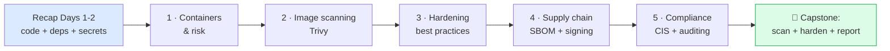
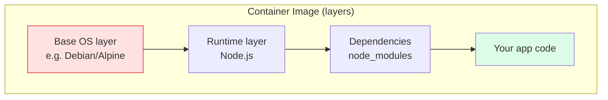
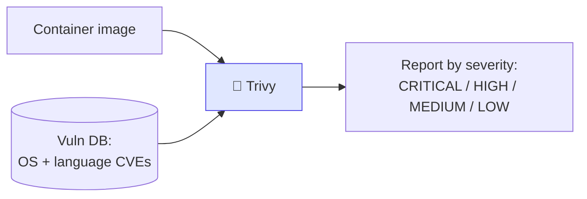
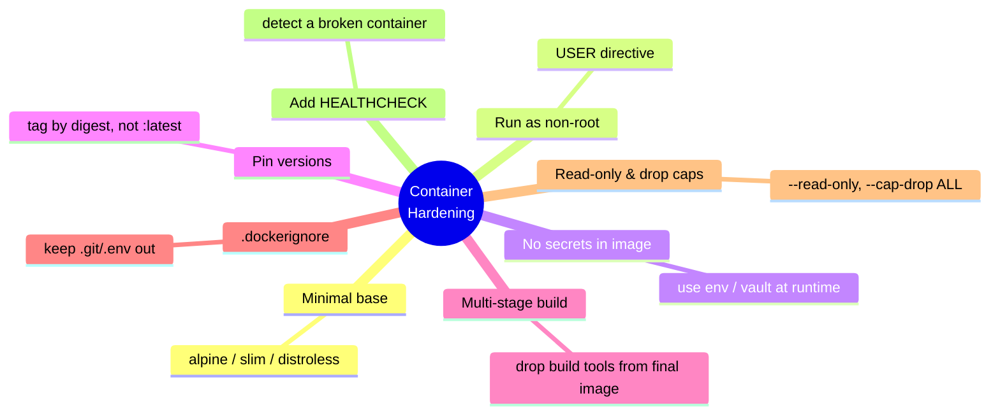
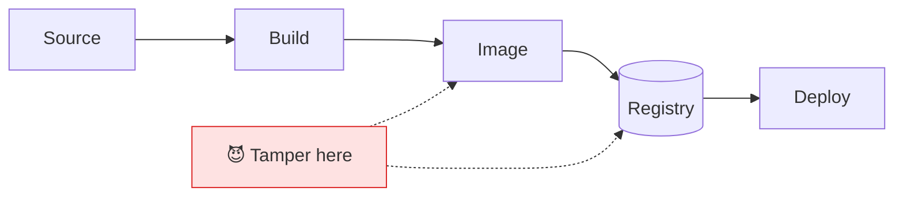
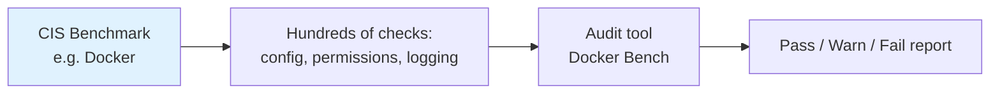
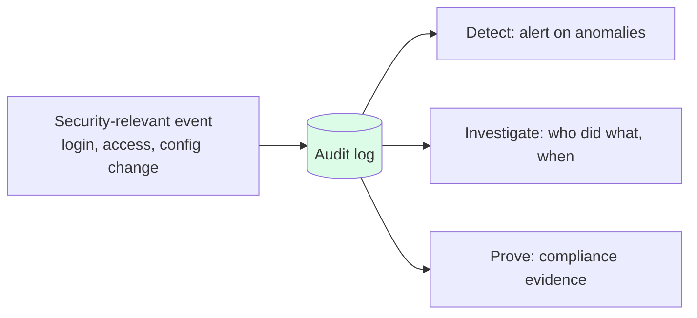
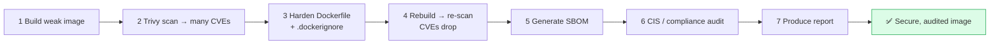

<div align="center">

<svg width="760" height="150" viewBox="0 0 760 150" xmlns="http://www.w3.org/2000/svg" role="img" aria-label="DevSecOps Day 3 banner">
  <defs>
    <linearGradient id="g3" x1="0" y1="0" x2="1" y2="1">
      <stop offset="0%" stop-color="#4c1d95"/>
      <stop offset="100%" stop-color="#8b5cf6"/>
    </linearGradient>
  </defs>
  <rect x="0" y="0" width="760" height="150" rx="16" fill="url(#g3)"/>
  <g transform="translate(50,40)" stroke="#ffffff" stroke-width="3.5" fill="#ffffff" fill-opacity="0.16">
    <rect x="0" y="34" width="26" height="26" rx="3"/>
    <rect x="30" y="34" width="26" height="26" rx="3"/>
    <rect x="60" y="34" width="26" height="26" rx="3"/>
    <rect x="15" y="6" width="26" height="26" rx="3"/>
    <rect x="45" y="6" width="26" height="26" rx="3"/>
    <path d="M-6 66 h104" stroke-width="4" stroke-linecap="round"/>
  </g>
  <text x="160" y="62" font-family="Segoe UI, Arial, sans-serif" font-size="34" font-weight="700" fill="#ffffff">DevSecOps Intensive</text>
  <text x="160" y="96" font-family="Segoe UI, Arial, sans-serif" font-size="20" fill="#ede9fe">Day 3 — Container Security &amp; Compliance</text>
  <text x="160" y="124" font-family="Segoe UI, Arial, sans-serif" font-size="14" fill="#ddd6fe">Hands-on study material</text>
</svg>

</div>

# 📘 Day 3 — Container Security + Compliance & Auditing

> **Program:** 4-Day DevSecOps Hands-on Training
> **Mode:** Fully practical, lab-driven
> **Scope of Day 3:** Container image scanning (Trivy, Aqua) · Container best practices · Supply-chain security · CIS Benchmarks · Audit logs & compliance reporting · Scanning Docker images · Generating compliance audit reports · Applying secure container configuration

---

## 🎯 Day 3 Learning Outcomes

After completing Day 3 you will be able to:

1. Explain what a **container image** is and why it carries security risk.
2. **Containerize VulnPortal** with a Dockerfile.
3. **Scan an image with Trivy** for OS and library vulnerabilities, and read the report.
4. Apply **container hardening best practices** (non-root, minimal base, no secrets, pinned versions).
5. Explain **supply-chain security**: SBOMs and image signing.
6. Understand **CIS Benchmarks** and run a **compliance audit** (Docker Bench, Trivy config scan).
7. Explain why **audit logs** matter (OWASP A09) and what a compliance report contains.

---

## 🗺 Day 3 Roadmap



> 🔁 **Where we are:** Days 1–2 secured VulnPortal's code, its dependencies, and its secrets. But software ships as a **container image** today. A perfectly-coded app inside an outdated, root-running, secret-leaking image is still insecure. Day 3 secures the *package and the platform*.

---

# 🔧 Prerequisites & Lab Setup

Reuses Docker, Node.js, and VulnPortal. Day 3 adds:

| Tool | Purpose | Install |
|---|---|---|
| **Trivy** | Scan images, filesystems & configs for vulnerabilities | via Docker (`aquasec/trivy`) |
| **Docker Bench for Security** | Check the Docker host against CIS Benchmark | via Docker |
| **Syft** (optional) | Generate a Software Bill of Materials (SBOM) | via Docker (`anchore/syft`) |

### 🧪 Lab 0 — Containerize VulnPortal (intentionally weak first)

Create this **deliberately insecure** `Dockerfile` in the project — we'll harden it later today:

```dockerfile
# Dockerfile  — INTENTIONALLY WEAK (we harden this in Module 3)
FROM node:18                 # ❌ huge image, runs as root
WORKDIR /app
COPY . .                     # ❌ copies everything, incl. .env / .git if present
RUN npm install              # ❌ installs dev deps too
EXPOSE 3000
CMD ["node", "app.js"]       # ❌ process runs as root
```

Build it:

```bash
cd vulnportal
docker build -t vulnportal:weak .
```

> ✅ **Expected:** an image named `vulnportal:weak` is built. This becomes the target for scanning.

---

# 📗 Module 1 — Containers & Why They Carry Risk

## 1.1 What is a container image?

A **container image** is a packaged snapshot of everything an app needs to run: the base operating system files, the runtime (e.g., Node.js), your code, and its dependencies — all in layers.



> 💡 **The hidden risk:** even if *your* code is perfect, the **base OS layer** ships hundreds of system packages (openssl, libc, curl…), any of which may have a CVE. A `node:18` image can contain dozens of known OS-level vulnerabilities you never wrote.

## 1.2 Three layers of container risk

| Risk | Example | Control |
|---|---|---|
| **Vulnerable image contents** | Old `openssl` in the base layer | **Image scanning** (Trivy) |
| **Insecure configuration** | Container runs as root | **Hardening** + config scan |
| **Untrusted supply chain** | Image tampered with after build | **Signing + SBOM** |

---

# 📗 Module 2 — Image Scanning with Trivy

## 2.1 What Trivy does

Trivy reads an image layer by layer, inventories every OS package and language dependency, and matches them against vulnerability databases.



### 🧪 Lab 2.1 — Scan the image

```bash
# Scan the image we built (mount the docker socket so Trivy can read local images)
docker run --rm \
  -v /var/run/docker.sock:/var/run/docker.sock \
  aquasec/trivy:latest image vulnportal:weak
```

> ✅ **Expected:** a table of vulnerabilities grouped by package, each with a **CVE**, **severity**, **installed version**, and **fixed version**. The `node:18` base will produce many findings.

### 🧪 Lab 2.2 — Make it CI-friendly

```bash
# Only fail on HIGH and CRITICAL, ignore unfixed ones (reduce noise)
docker run --rm -v /var/run/docker.sock:/var/run/docker.sock \
  aquasec/trivy:latest image \
  --severity HIGH,CRITICAL --ignore-unfixed \
  --exit-code 1 vulnportal:weak
```

| Flag | Effect |
|---|---|
| `--severity HIGH,CRITICAL` | Show only serious issues |
| `--ignore-unfixed` | Hide CVEs with no patch available yet |
| `--exit-code 1` | Return non-zero so a CI job **fails** |
| `--format json -o report.json` | Machine-readable output |

### 🧪 Lab 2.3 — Trivy also scans filesystems and Dockerfiles

```bash
# Scan project files (deps + secrets) without building an image
docker run --rm -v "$(pwd):/src" aquasec/trivy:latest fs /src

# Scan the Dockerfile itself for misconfigurations
docker run --rm -v "$(pwd):/src" aquasec/trivy:latest config /src
```

> 💡 **One tool, many jobs:** Trivy does image, filesystem, config (IaC), and secret scanning — which is why it's a DevSecOps favourite.

## 2.2 Aqua (conceptual)

**Aqua Security** is the commercial enterprise platform (Trivy is its open-source scanner). Beyond scanning, Aqua adds runtime protection, admission control (blocking bad images from even deploying to Kubernetes), and central policy dashboards — the kind of governance used in large organisations.

### 🧠 Check your understanding
1. Why can a perfectly-coded app still ship in a vulnerable image?
2. Which Trivy flag makes a CI job fail?
3. Name two things Trivy can scan besides images.

---

# 📗 Module 3 — Container Hardening Best Practices

## 3.1 The checklist



| Practice | Why |
|---|---|
| **Minimal base image** (`alpine`, `slim`, `distroless`) | Fewer packages = fewer CVEs and smaller attack surface |
| **Run as non-root** (`USER node`) | If the app is breached, the attacker isn't root inside the container |
| **No secrets baked in** | Images get shared; a secret in a layer leaks to everyone |
| **Pin versions** (digest, not `:latest`) | Reproducible, and prevents silently pulling a tampered tag |
| **Multi-stage build** | Build tools/dev deps don't ship in the final image |
| **`.dockerignore`** | Keeps `.git`, `.env`, `node_modules` out of the image |
| **Drop capabilities / read-only FS** | Limits what a compromised container can do |
| **`HEALTHCHECK`** | The orchestrator can detect and restart a broken container |

## 3.2 Lab — Rewrite the Dockerfile (hardened)

Create a `.dockerignore`:

```
node_modules
.git
.env
*.log
odc-report
```

Replace the weak `Dockerfile` with a hardened, multi-stage version:

```dockerfile
# ✅ HARDENED Dockerfile
# ---- build stage ----
FROM node:18-alpine AS build
WORKDIR /app
COPY package*.json ./
RUN npm ci --omit=dev          # production deps only, reproducible

# ---- runtime stage ----
FROM node:18-alpine
WORKDIR /app
COPY --from=build /app/node_modules ./node_modules
COPY app.js ./
ENV NODE_ENV=production
USER node                       # ✅ run as the built-in non-root user
EXPOSE 3000
HEALTHCHECK --interval=30s --timeout=3s \
  CMD wget -qO- http://localhost:3000/ || exit 1
CMD ["node", "app.js"]
```

Rebuild and re-scan:

```bash
docker build -t vulnportal:secure .
docker run --rm -v /var/run/docker.sock:/var/run/docker.sock \
  aquasec/trivy:latest image --severity HIGH,CRITICAL vulnportal:secure
```

> ✅ **Expected:** the `alpine` base produces **far fewer** findings than `node:18`, and the image is dramatically smaller. Compare with `docker images` to see the size drop.

### 🧪 Run it with extra runtime hardening

```bash
docker run -d --name portal \
  --read-only --cap-drop ALL \
  --tmpfs /tmp \
  -p 3000:3000 \
  -e VAULT_ADDR -e VAULT_TOKEN \
  vulnportal:secure
```

> 💡 **Layered defence:** the secure Dockerfile hardens the *image*; `--read-only` and `--cap-drop ALL` harden the *running container*. Both matter.

---

# 📗 Module 4 — Supply-Chain Security

## 4.1 The problem

You trust an image — but can you *prove* what's inside it and that nobody tampered with it after it was built? The **SolarWinds (2020)** attack inserted malicious code into a trusted build, so every downstream customer received it.



## 4.2 Two controls

| Control | What it gives you | Tool |
|---|---|---|
| **SBOM** (Software Bill of Materials) | A complete ingredient list of the image — every package & version | Syft, Trivy |
| **Image signing** | Cryptographic proof of *who* built the image and that it's unchanged | Cosign (Sigstore) |

### 🧪 Lab 4.1 — Generate an SBOM

```bash
# With Trivy
docker run --rm -v /var/run/docker.sock:/var/run/docker.sock \
  aquasec/trivy:latest image --format cyclonedx -o /dev/stdout vulnportal:secure

# Or with Syft
docker run --rm -v /var/run/docker.sock:/var/run/docker.sock \
  anchore/syft:latest vulnportal:secure
```

> 💡 **Why an SBOM matters:** when the *next* Log4Shell is announced, you can instantly answer "are we affected?" by searching every SBOM — instead of guessing.

---

# 📗 Module 5 — Compliance & Auditing

## 5.1 CIS Benchmarks

The **CIS (Center for Internet Security) Benchmarks** are consensus-built, step-by-step hardening standards for systems — including the **CIS Docker Benchmark** and **CIS Kubernetes Benchmark**. Compliance frameworks (and clients) frequently require them.



### 🧪 Lab 5.1 — Audit the Docker host against CIS (Docker Bench)

```bash
docker run --rm --net host --pid host --userns host --cap-add audit_control \
  -v /var/lib:/var/lib:ro \
  -v /var/run/docker.sock:/var/run/docker.sock:ro \
  -v /etc:/etc:ro \
  docker/docker-bench-security
```

> ✅ **Expected:** a long checklist of `[PASS]`, `[WARN]`, `[INFO]`, `[NOTE]` items mapped to CIS Docker Benchmark sections (host config, daemon config, container runtime, etc.).
> 🧯 **Permissions:** this audit needs host-level access; it runs best on a Linux host or a Linux VM rather than inside restricted environments.

### 🧪 Lab 5.2 — Compliance report from Trivy

```bash
# Trivy can report directly against a compliance spec
docker run --rm -v /var/run/docker.sock:/var/run/docker.sock \
  aquasec/trivy:latest image --compliance docker-cis-1.6.0 vulnportal:secure
```

## 5.2 Audit logs (OWASP A09)

**Logging & monitoring failures (A09)** means: if an attack happens and nothing is recorded, you can neither detect nor investigate it.



**What a good audit log records:** *who* (identity), *what* (action), *when* (timestamp), *where* (source IP/host), and *outcome* (success/failure) — while **never** logging the secrets or passwords themselves.

## 5.3 What a compliance report contains

| Section | Contents |
|---|---|
| Scope | What was assessed (image, host, app) |
| Standard | Which benchmark/framework (CIS, PCI-DSS, ISO 27001…) |
| Findings | Each check: pass/fail, severity, evidence |
| Remediation | How to fix each failed check |
| Summary | Overall posture + trend over time |

### 🧠 Check your understanding
1. What is a CIS Benchmark?
2. Which OWASP category is about logging failures?
3. What five fields should an audit log entry contain?

---

# 🏁 Capstone Lab — Scan → Harden → Report



### 📋 Capstone checklist
- [ ] Build `vulnportal:weak` and scan it with Trivy — record CRITICAL/HIGH counts and image size.
- [ ] Add `.dockerignore` and rewrite the Dockerfile (alpine, multi-stage, non-root, healthcheck).
- [ ] Build `vulnportal:secure`, re-scan, and record the **before/after** CVE counts and size.
- [ ] Run the container with `--read-only --cap-drop ALL`.
- [ ] Generate an SBOM for the secure image.
- [ ] Run a CIS/compliance audit (Docker Bench and/or Trivy `--compliance`) and save the report.

> ✅ **Success criteria:** the hardened image shows materially fewer HIGH/CRITICAL CVEs and a smaller size than the weak one, runs as non-root, and you can produce both an SBOM and a compliance report.

---

# 📝 Day 3 Assignment

1. **Before/after table:** CVE counts (by severity) and image size for `vulnportal:weak` vs `vulnportal:secure`. Explain the biggest single reason for the improvement.
2. **Hardening rationale (½ page):** For each of 5 best practices applied, state the attack it mitigates.
3. **SBOM use case:** Explain in your own words how an SBOM helps when a new CVE is announced.
4. **Compliance summary:** From your Docker Bench / Trivy compliance run, list 3 failed checks and their fixes.
5. **Bonus:** Add a Trivy image-scan step to the CI workflow that fails the build on HIGH/CRITICAL.

---

# 💼 Use Cases / Discussion Prompts

| Scenario | Discuss |
|---|---|
| A team always uses `FROM node:latest`. | What two risks does this create, and what should they do instead? |
| A container is breached, and it was running as root. | How does running as non-root change the blast radius? |
| A client demands CIS Docker Benchmark compliance before go-live. | Which tools produce the evidence, and what does the report include? |
| An auditor asks "exactly which libraries are in production?" | Which artifact answers this instantly? *(The SBOM.)* |

---

# 🧪 Day 3 Mini-Assessment

1. What is a container image, in one sentence?
2. Why does the base image contribute most CVEs?
3. Which tool scans images for vulnerabilities?
4. Name three container hardening best practices.
5. Why run a container as non-root?
6. What is a multi-stage build for?
7. What is an SBOM?
8. What does image signing prove?
9. What is a CIS Benchmark?
10. Which OWASP category covers missing audit logs?

<details>
<summary>📋 Answer key</summary>

1. A packaged, layered snapshot of an app plus everything it needs to run.
2. It bundles a whole OS with many system packages, any of which may have CVEs.
3. Trivy (also Aqua, Grype, Clair).
4. e.g., minimal base, non-root user, no baked-in secrets, pinned versions, multi-stage build.
5. So a compromised app isn't root inside the container — smaller blast radius.
6. To keep build tools/dev dependencies out of the final shipped image.
7. Software Bill of Materials — a complete inventory of an image's contents.
8. Who built the image and that it hasn't been tampered with since.
9. A consensus hardening standard with concrete checks for a system/platform.
10. A09 — Security Logging & Monitoring Failures.
</details>

---

# 🧾 Day 3 Command Cheat-Sheet

```bash
# Build images
docker build -t vulnportal:weak .
docker build -t vulnportal:secure .
docker images                                  # compare sizes

# Trivy scans
docker run --rm -v /var/run/docker.sock:/var/run/docker.sock \
  aquasec/trivy:latest image vulnportal:weak
docker run --rm -v /var/run/docker.sock:/var/run/docker.sock \
  aquasec/trivy:latest image --severity HIGH,CRITICAL --exit-code 1 vulnportal:secure
docker run --rm -v "$(pwd):/src" aquasec/trivy:latest fs /src
docker run --rm -v "$(pwd):/src" aquasec/trivy:latest config /src

# SBOM
docker run --rm -v /var/run/docker.sock:/var/run/docker.sock \
  anchore/syft:latest vulnportal:secure

# Hardened runtime
docker run -d --name portal --read-only --cap-drop ALL --tmpfs /tmp \
  -p 3000:3000 vulnportal:secure

# Compliance / CIS
docker run --rm --net host --pid host --cap-add audit_control \
  -v /var/run/docker.sock:/var/run/docker.sock:ro -v /etc:/etc:ro \
  docker/docker-bench-security
docker run --rm -v /var/run/docker.sock:/var/run/docker.sock \
  aquasec/trivy:latest image --compliance docker-cis-1.6.0 vulnportal:secure
```

---

# 📚 Glossary

| Term | Meaning |
|---|---|
| **Container image** | A layered, packaged snapshot of an app and its environment |
| **Base image** | The starting OS/runtime layer (e.g., `node:18-alpine`) |
| **Trivy** | Open-source scanner for images, filesystems, configs, secrets |
| **Distroless** | A minimal base image with no shell or package manager |
| **Multi-stage build** | Building in one stage, shipping only the result in another |
| **Non-root** | Running the container process as an unprivileged user |
| **SBOM** | Software Bill of Materials — inventory of image contents |
| **Cosign** | Tool for signing and verifying container images |
| **CIS Benchmark** | Consensus hardening standard with concrete checks |
| **Docker Bench** | Tool that audits Docker against the CIS Benchmark |
| **Audit log** | Record of security-relevant events (who/what/when/where/outcome) |

---

# ➡️ Coming Up — Day 4 Preview

Day 4 brings everything together into one **end-to-end DevSecOps workflow** — the **Secure Student Portal** capstone:

- Integrate **code scanning + dependency scanning + secrets management + image scanning + compliance** into a single CI pipeline.
- Build the complete security workflow from commit to deploy.
- **Hands-on project:** implement all scanning stages in CI, serve the portal's secret from a vault, and gate releases on Trivy image scans.
- **Weekly assessment** covering Days 1–4.

---

<div align="center">

**End of Day 3**
*Container Security · Trivy · Hardening · Supply Chain · CIS & Auditing*

</div>
