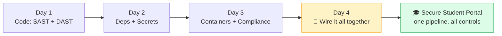
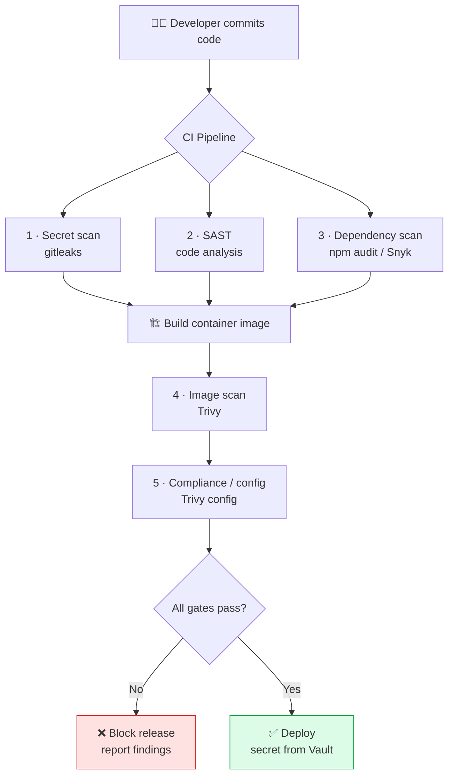
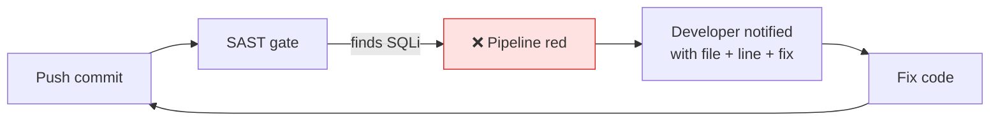
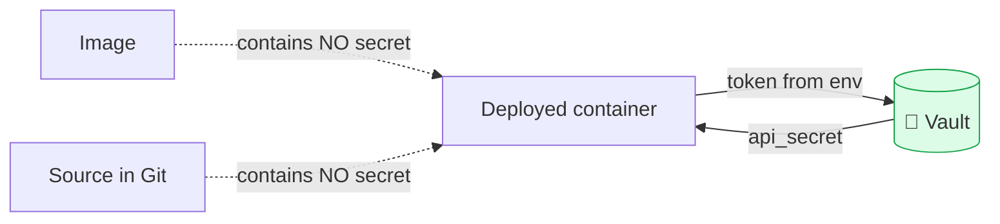
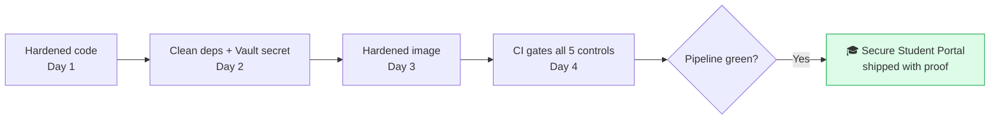
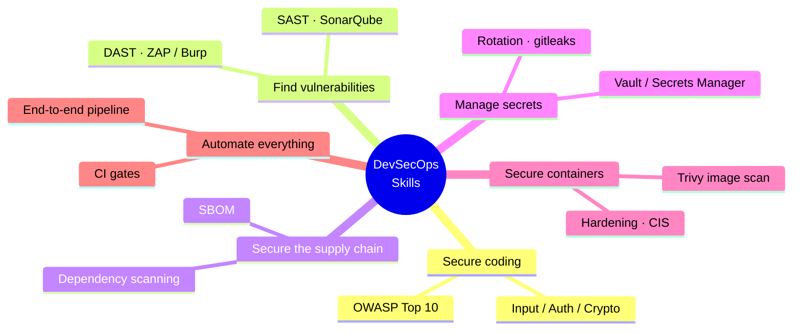

<div align="center">

<svg width="760" height="150" viewBox="0 0 760 150" xmlns="http://www.w3.org/2000/svg" role="img" aria-label="DevSecOps Day 4 banner">
  <defs>
    <linearGradient id="g4" x1="0" y1="0" x2="1" y2="1">
      <stop offset="0%" stop-color="#92400e"/>
      <stop offset="100%" stop-color="#f59e0b"/>
    </linearGradient>
  </defs>
  <rect x="0" y="0" width="760" height="150" rx="16" fill="url(#g4)"/>
  <g transform="translate(56,30)" fill="none" stroke="#ffffff" stroke-width="4" stroke-linecap="round" stroke-linejoin="round">
    <circle cx="44" cy="45" r="40" stroke-opacity="0.85" fill="#ffffff" fill-opacity="0.14"/>
    <path d="M26 46 l12 12 l26 -28"/>
    <path d="M44 5 v8 M44 77 v8 M4 45 h8 M76 45 h8" stroke-opacity="0.6"/>
  </g>
  <text x="160" y="62" font-family="Segoe UI, Arial, sans-serif" font-size="34" font-weight="700" fill="#ffffff">DevSecOps Intensive</text>
  <text x="160" y="96" font-family="Segoe UI, Arial, sans-serif" font-size="20" fill="#fef3c7">Day 4 — End-to-End Capstone &amp; Assessment</text>
  <text x="160" y="124" font-family="Segoe UI, Arial, sans-serif" font-size="14" fill="#fde68a">Hands-on study material</text>
</svg>

</div>

# 📘 Day 4 — Capstone: The Secure Student Portal (End-to-End DevSecOps)

> **Program:** 4-Day DevSecOps Hands-on Training
> **Mode:** Fully practical, project-driven
> **Scope of Day 4:** Case study — Secure Student Portal · Integrating code scanning, dependency scanning, secrets management, container/image scanning & compliance checks · Building a DevSecOps security workflow end-to-end · Implementing security scanning in CI · Applying a secrets manager to the portal · Scanning container images with Trivy · Weekly assessment

---

## 🎯 Day 4 Learning Outcomes

After completing Day 4 you will be able to:

1. Combine **all five controls** from Days 1–3 into one coherent security workflow.
2. Build a **complete CI pipeline** that gates a release on security, from commit to deploy.
3. Implement **SAST, dependency, secret, image, and compliance** scanning as automated pipeline stages.
4. Serve the portal's secret from a **vault** at runtime, with nothing in source.
5. Read a pipeline run, understand **why a build was blocked**, and fix it.
6. Pass the **weekly assessment** covering the full program.

---

## 🗺 The journey so far → the capstone



> 🔁 **The big idea:** the **Secure Student Portal** is simply the VulnPortal we've been hardening all week — now wrapped in an automated pipeline that re-checks every control on every change. Individually the tools are useful; chained together and automated, they become *DevSecOps*.

---

# 🔧 Prerequisites & Lab Setup

Everything from Days 1–3 is reused: the hardened VulnPortal code, the hardened multi-stage Dockerfile, Vault, and the scanners (SonarQube/Semgrep, Snyk/npm audit, gitleaks, Trivy). No new tools are required; today is integration.

> 💡 If any earlier artifact is missing (e.g., the hardened `Dockerfile` or `.dockerignore`), recreate it from the Day 2/Day 3 sheets before starting.

---

# 📗 Module 1 — The Case Study: Secure Student Portal

## 1.1 The scenario

A college needs a **Student Portal** (login, profile, search) handling personal data. It must be built so that security is verified automatically on every code change — no manual gate, no human forgetting a step. We treat our hardened VulnPortal as that portal and prove its security end-to-end.

## 1.2 The five controls and where each runs



| Stage | Control | Tool | OWASP / risk addressed |
|---|---|---|---|
| 1 | Secret scanning | gitleaks | secrets in code |
| 2 | Static analysis (SAST) | SonarQube / Semgrep | A03 Injection, A02 Crypto |
| 3 | Dependency scanning | npm audit / Snyk | A06 Vulnerable components |
| 4 | Image scanning | Trivy | OS/library CVEs in the image |
| 5 | Compliance / config | Trivy config / CIS | A05 Misconfiguration |
| Runtime | Secrets management | Vault | secrets never in code/image |
| Always | Audit logging | app + platform | A09 Logging failures |

---

# 📗 Module 2 — Building the End-to-End CI Pipeline

## 2.1 The principle: every control becomes a gate

A **gate** is a pipeline step that **fails the build** when it finds something serious. A failed gate blocks the release. This is how "shift-left" becomes enforced rather than optional.

## 2.2 Lab — The complete pipeline

Create `.github/workflows/devsecops.yml`. (The same stages map directly to GitLab CI, Jenkins, or Azure DevOps — only the syntax differs.)

```yaml
name: DevSecOps Pipeline
on: [push, pull_request]

jobs:
  security:
    runs-on: ubuntu-latest
    steps:
      - uses: actions/checkout@v4
        with:
          fetch-depth: 0          # full history so secret scanning sees all commits

      # ---- GATE 1: Secret scanning ----
      - name: Secret scan (gitleaks)
        uses: gitleaks/gitleaks-action@v2
        env:
          GITHUB_TOKEN: ${{ secrets.GITHUB_TOKEN }}

      - uses: actions/setup-node@v4
        with:
          node-version: 20
      - run: npm ci

      # ---- GATE 2: SAST ----
      - name: SAST (Semgrep)
        uses: returntocorp/semgrep-action@v1
        with:
          config: p/owasp-top-ten

      # ---- GATE 3: Dependency scan ----
      - name: Dependency scan (npm audit)
        run: npm audit --audit-level=high

      # ---- Build the image ----
      - name: Build image
        run: docker build -t secure-portal:${{ github.sha }} .

      # ---- GATE 4: Image scan ----
      - name: Image scan (Trivy)
        uses: aquasecurity/trivy-action@master
        with:
          image-ref: secure-portal:${{ github.sha }}
          severity: HIGH,CRITICAL
          exit-code: '1'
          ignore-unfixed: true

      # ---- GATE 5: Config / compliance scan ----
      - name: Config scan (Trivy)
        uses: aquasecurity/trivy-action@master
        with:
          scan-type: config
          scan-ref: .
          severity: HIGH,CRITICAL
          exit-code: '1'

      # ---- Deploy only if every gate passed ----
      - name: Deploy (placeholder)
        if: success()
        run: echo "All gates passed — deploying. Secret is fetched from Vault at runtime."
```

> 💡 **Read the order:** cheap, fast checks (secret + SAST + deps) run **before** the expensive image build, so the pipeline fails fast and saves time. Image and config scans run **after** the build because they need the built image.

> 🧯 **`secrets.GITHUB_TOKEN`** is provided automatically by GitHub Actions. `SNYK_TOKEN` (if you swap Snyk in for npm audit) must be added under repo **Settings → Secrets**. Never paste tokens into the YAML.

## 2.3 What a blocked build looks like



This loop — *push → blocked → fix → push → pass* — is the daily reality of DevSecOps. The pipeline is a safety net that catches mistakes before customers do.

### 🧠 Check your understanding
1. What is a pipeline "gate"?
2. Why run secret/SAST/dependency scans before building the image?
3. Where is the `SNYK_TOKEN` stored — and where is it never stored?

---

# 📗 Module 3 — Applying the Secrets Manager to the Portal

The portal must run with **no secret in its code or its image** — it fetches the secret from Vault at startup (as built on Day 2).



### 🧪 Lab 3.1 — Run the portal wired to Vault

```bash
# Vault running from Day 2 with secret/vulnportal -> api_secret
export VAULT_ADDR='http://127.0.0.1:8200'
export VAULT_TOKEN='root'           # in production: a scoped, short-lived token, injected by the platform

docker run -d --name secure-portal \
  --read-only --cap-drop ALL --tmpfs /tmp \
  -p 3000:3000 \
  -e VAULT_ADDR=http://host.docker.internal:8200 \
  -e VAULT_TOKEN=$VAULT_TOKEN \
  vulnportal:secure
```

> ✅ **Expected:** the app logs `Secret loaded from Vault` and starts. Confirm with `git grep -i secret` and `docker history vulnportal:secure` that **no secret value** appears in the code or image layers.

> 💡 **Production note:** dev-mode Vault and a `root` token are for learning. In production the platform (e.g., Kubernetes + Vault Agent, or cloud IAM + Secrets Manager) injects a **short-lived, narrowly-scoped** credential automatically — the app still never holds a long-lived secret.

---

# 📗 Module 4 — Scanning Container Images in the Workflow

Image scanning (Day 3) becomes **Gate 4**: the build is blocked if the image has HIGH/CRITICAL CVEs.

### 🧪 Lab 4.1 — Prove the gate works both ways

```bash
# The hardened image should PASS the gate (few/no HIGH-CRITICAL, exit 0)
docker run --rm -v /var/run/docker.sock:/var/run/docker.sock \
  aquasec/trivy:latest image --severity HIGH,CRITICAL --exit-code 1 vulnportal:secure
echo "Exit: $?"   # expect 0

# The old weak image should FAIL the gate (exit 1)
docker run --rm -v /var/run/docker.sock:/var/run/docker.sock \
  aquasec/trivy:latest image --severity HIGH,CRITICAL --exit-code 1 vulnportal:weak
echo "Exit: $?"   # expect non-zero
```

> 💡 **This contrast is the whole point:** the *same gate* lets the secure image through and blocks the weak one — automatically, with no human judgment required at release time.

---

# 🏁 Capstone Project — The Full Workflow

Deliver the Secure Student Portal as a verifiable, automated DevSecOps pipeline.



### 📋 Capstone deliverables
- [ ] **Repo** containing the hardened app, hardened `Dockerfile`, `.dockerignore`, and the pipeline YAML.
- [ ] **Gate 1 — Secret scan:** gitleaks passes (no secrets in code or history of the final repo).
- [ ] **Gate 2 — SAST:** no high-severity code findings remain.
- [ ] **Gate 3 — Dependency scan:** clean at the chosen severity threshold.
- [ ] **Gate 4 — Image scan:** Trivy passes on `vulnportal:secure`; demonstrate it *fails* on `vulnportal:weak`.
- [ ] **Gate 5 — Config/compliance:** Trivy config scan passes.
- [ ] **Secret at runtime:** the portal loads its secret from Vault; nothing sensitive in code or image.
- [ ] **Evidence pack:** screenshots of one **red** (blocked) run and one **green** (passing) run, plus the SBOM and a short compliance summary.

> ✅ **Success criteria:** a single push triggers all five gates; an intentionally-bad change (e.g., re-introducing the hardcoded secret or downgrading a library) turns the pipeline **red**; reverting it turns it **green**.

---

# 🧪 Weekly Assessment (Days 1–4)

### Part A — Concepts (short answer)
1. Define DevSecOps and "shift left."
2. List the OWASP Top 10 categories practised this week and the control for each.
3. Explain SAST vs DAST with one tool each.
4. Why must secrets never live in code? What is the only safe response to a leak?
5. Why does a base container image contribute most CVEs, and how is that reduced?
6. What is an SBOM and when is it invaluable?
7. What is a CIS Benchmark, and which tool audits Docker against it?
8. What is a CI "gate," and how does it enforce shift-left?

### Part B — Practical (demonstrate)
1. Find and fix a SQL injection in the portal; prove it with SAST + DAST.
2. Introduce an old library, detect it with a dependency scan, and remediate.
3. Store and retrieve a secret in Vault, and show the code is secret-free.
4. Harden the Dockerfile and show the before/after Trivy CVE counts.
5. Run the full pipeline; show one blocked run and one passing run.

### Part C — Scenario (discuss/write)
> A new critical CVE is announced for a library used across many of the organisation's services. Using only the artifacts and tools from this week, describe step by step how you would (a) determine if the Secure Student Portal is affected, (b) remediate, and (c) prevent the vulnerable version from ever shipping again.

<details>
<summary>📋 Assessment guidance (model points)</summary>

- **A1:** Security built into every DevOps stage, automated and shared; "shift left" = doing it earlier.
- **A3:** SAST = source code, app not running (SonarQube); DAST = running app from outside (ZAP).
- **A4:** Git history is permanent; rotate the credential immediately.
- **A5:** Base image bundles a full OS; use minimal/distroless bases and multi-stage builds.
- **A6:** Inventory of image contents; invaluable when a new CVE drops — search SBOMs to find exposure.
- **A8:** A step that fails the build on serious findings, blocking release automatically.
- **Part C:** (a) search SBOMs / run dependency scan; (b) upgrade the library, rebuild, re-scan image; (c) keep the dependency + image gates in CI so a vulnerable version fails the pipeline.
</details>

---

# 💼 Use Cases / Discussion Prompts

| Scenario | Discuss |
|---|---|
| Leadership asks: "How do we *prove* to a client our software is secure?" | Which artifacts form the evidence? *(Pipeline logs, SBOM, scan + compliance reports.)* |
| A hotfix must ship in 30 minutes; a gate is failing. | What are the safe options? When is it acceptable to bypass a gate, and how is that governed? |
| The team has all tools but runs them manually and inconsistently. | What single change delivers the biggest security gain? *(Automate them as CI gates.)* |
| A junior asks where to start securing a brand-new service. | Map the five controls onto the new pipeline in order. |

---

# 🧾 Day 4 Command Cheat-Sheet

```bash
# Run the portal wired to Vault (no secret in code/image)
docker run -d --name secure-portal --read-only --cap-drop ALL --tmpfs /tmp \
  -p 3000:3000 -e VAULT_ADDR=http://host.docker.internal:8200 -e VAULT_TOKEN=$VAULT_TOKEN \
  vulnportal:secure

# Prove no secret is baked in
git grep -i secret
docker history vulnportal:secure

# Image-scan gate — secure passes, weak fails
docker run --rm -v /var/run/docker.sock:/var/run/docker.sock \
  aquasec/trivy:latest image --severity HIGH,CRITICAL --exit-code 1 vulnportal:secure ; echo $?
docker run --rm -v /var/run/docker.sock:/var/run/docker.sock \
  aquasec/trivy:latest image --severity HIGH,CRITICAL --exit-code 1 vulnportal:weak   ; echo $?

# Local dry-run of each gate before pushing
docker run --rm -v "$(pwd):/repo" zricethezav/gitleaks:latest detect --source=/repo -v
npm audit --audit-level=high
docker run --rm -v "$(pwd):/src" aquasec/trivy:latest config /src
```

---

# 📚 Glossary

| Term | Meaning |
|---|---|
| **Pipeline** | The automated sequence of steps run on each code change |
| **Gate** | A step that fails the build (blocks release) on serious findings |
| **Fail fast** | Ordering cheap checks first so failures surface quickly |
| **CI/CD** | Continuous Integration / Continuous Delivery |
| **Evidence pack** | Collected proof of security checks (logs, SBOM, reports) |
| **Short-lived credential** | A secret valid only briefly, limiting leak impact |
| **Shift left** | Performing security checks early and automatically |
| **End-to-end workflow** | All controls chained from commit to deploy |

---

# ✅ Program Wrap-Up — What You Can Now Do



You started with a vulnerable application and ended with an automated pipeline that finds, blocks, and proves the absence of security flaws on every change — the core competency of a modern DevSecOps engineer.

---

<div align="center">

**End of Day 4 — Program Complete**
*Code · Dependencies · Secrets · Containers · Compliance — automated, end-to-end*

</div>
